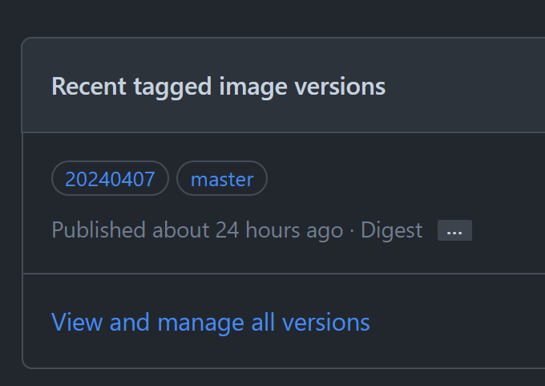

I've always wanted to display stock/crypto quote in my Discord server. To address this need, I found the [rssnyder/discord-stock-ticker](https://github.com/rssnyder/discord-stock-ticker), a daemon designed to provide asset quotes in Discord through periodic updates to the bot's name. However, the original configuration did not meet my specific requirements, leading me to [fork and modify the repository](https://github.com/bocchi-the-crypto/discord-stock-ticker/). Here, I'll detail the steps I took to customize and deploy this solution.

## Main Differences

The original bot displayed the asset's name in the bot name.


I wanted the bot name to show the price instead, with the status text including the trading pair and price change over past 24 hours.


## Deployment on Linux

I created new version of build workflow, including build date as one of the tags of the [container images](https://github.com/bocchi-the-crypto/discord-stock-ticker/pkgs/container/discord-stock-ticker).



I then write a `docker-compose.yaml` to host the daemon in a simple way:

```yaml
services:
  discord-stock-ticker:
    image: ghcr.io/bocchi-the-crypto/discord-stock-ticker:20240407
    restart: unless-stopped
    stop_grace_period: 1m
    logging:
      driver: json-file
      options:
        max-size: "10m"
        max-file: "3"

    # expose web API to host
    ports:
      - "127.0.0.1:7439:8080"

    # persist configuration in DB
    # you can omit the `volumes` and `command` below if you don't need
    volumes:
      - /data/discord-stock-ticker/discordbottickers.db:/app/discordbottickers.db
    command: "-db=/app/discordbottickers.db"
```

Run `sudo docker compose up -d` to start daemon in background.

## Discord Configuration

First, register a new bot, do some decoration e.g., icon:


Generate bot 'Install Link', in 'Default Install Settings' you need to set:
- SCOPES: applications.commands, bot
- PERMISSIONS: Change Nickname, Manage Roles


Browse to 'Install Link', add the bot to your server:


You might be asking 'where's the bot token?' well, you have to generate one by pressing 'Reset Token' button:
Warning: The current existing token will become invalid, do this with caution!


## Daemon Configuration

I prepared a JSON configuration files for the bots I intended to deploy. I will use `ADAUSD` for example.

I saved the text below as `discord-adausd-bot-data.json`:

```json
{
  "ticker": "ADAUSD",
  "name": "cardano",
  "crypto": true,
  "color": false,
  "nickname": true,
  "frequency": 60,
  "decimals": 2,
  "discord_bot_token": "MT....................A"
}
```

Call the API endpoint to register the bot for regular ADA price update:

```bash
curl -X POST -H "Content-Type: application/json" --data @discord-adausd-bot-data.json http://localhost:7439/ticker
```

You will see a json response after sending the request, inpect the text to determine the result.
