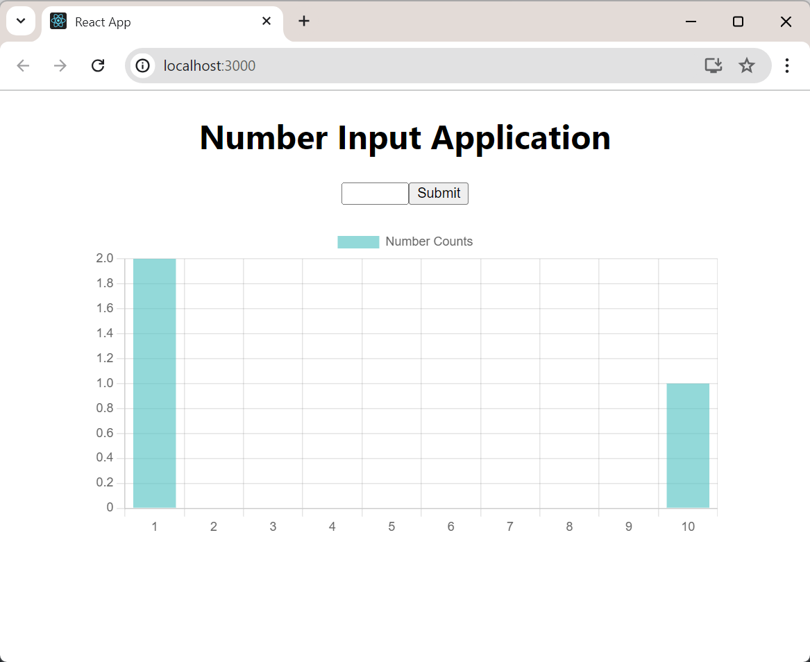
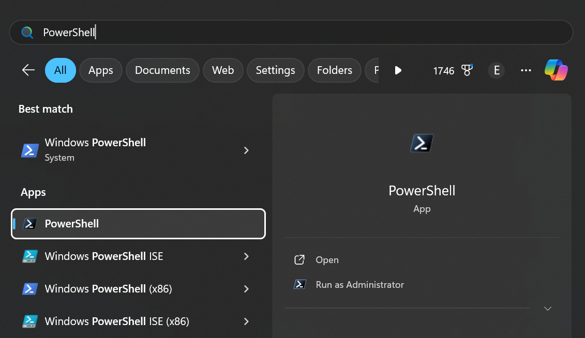
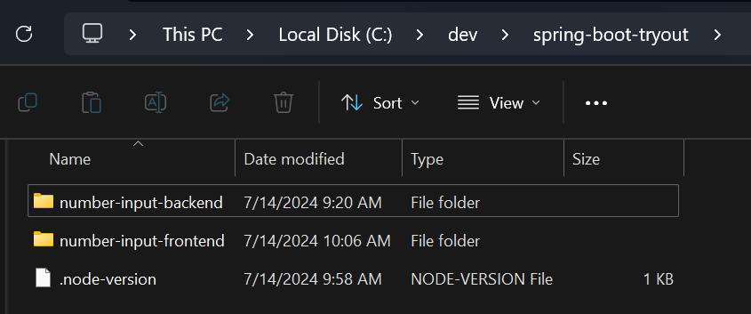
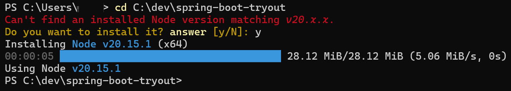
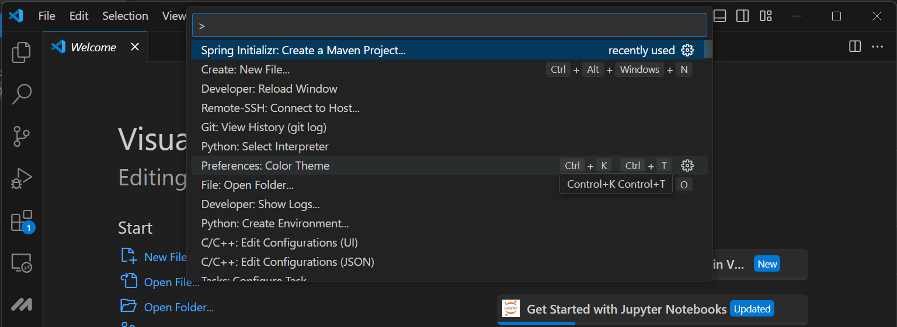
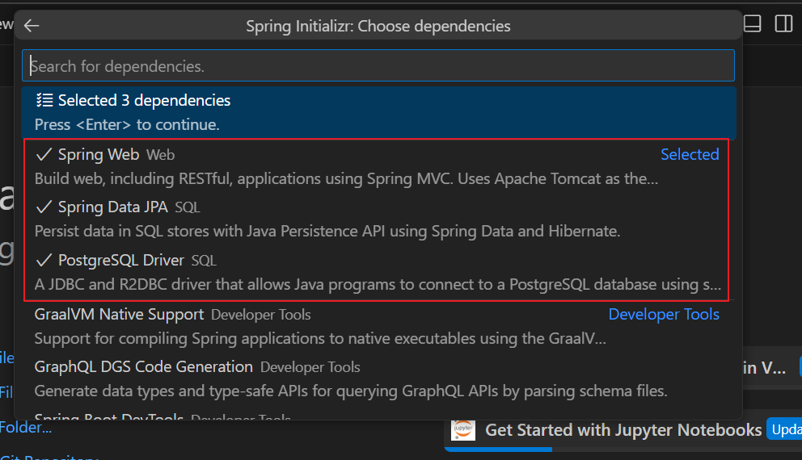
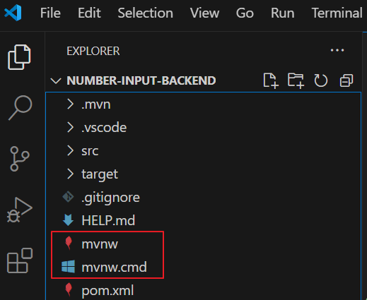

## Introduction

In this tutorial, we'll build our first-ever full-stack application using Spring Boot for the backend and React for the frontend. Our application will:
* allow users to input numbers, store them in a PostgreSQL database
* visualize how many times each number was input on a chart

The code is available on [my GitHub](https://github.com/ukewea/spring-boot-tryout)

The final application will look like this:



## Part 1: Setting Up the Development Environment on Windows

I'll be using PowerShell as my terminal, and I'll assume you're using Windows 11.

### 1.1 Install PowerShell and Windows Terminal

Install PowerShell from the [official GitHub repo](https://github.com/PowerShell/PowerShell)
Install Windows Terminal in Microsoft Store, or its [official GitHub repo](https://github.com/microsoft/terminal) if your computer does not allow you to install apps from the Microsoft Store.

Note this is not "Windows PowerShell", it's a newer version of PowerShell that's redesigned to be cross platform compatible.

Look at the screenshot below, after you install the "PowerShell", you will have 2 PowerShell when you search in the start menu, what the "PowerShell" will be used in the tutorial is the one without the "Windows" branding.



### 1.2 Installing Java Development Kit (JDK)

We'll use JDK 21 from Adoptium for this project:

1. Visit https://adoptium.net/
2. Download and install latest LTS version

Remember to add the JDK bin directory to your `PATH` environment variable.

### 1.3 Install Maven

Maven is a build automation tool used to manage the build process of a project. It helps manage dependencies, compile code, and run tests. Spring Boot is built on top of Maven, so we'll need to install Maven.

Just download Maven jar from official site and drop it to any directory which is in your `PATH` environment variable.

### 1.4 Installing Node.js using fnm (Fast Node Manager)

For Windows users, we'll use fnm to manage Node.js versions, follow the instructions on [offcial repo](https://github.com/Schniz/fnm), mainly including:

1. install with winget: `winget install Schniz.fnm`
2. add `fnm env --use-on-cd | Out-String | Invoke-Expression` to your PowerShell profile
   - your PowerShell profile should be in `$profile`, you could open it using the command `notepad $profile`
   - if `$profile` does not exist, create it using PowerShell command `new-item -type file -path $profile -force`
3. add `.node-version` with the version number of your choice
   
   * The content inside the file should look like, for example:
     ```
     20
     ```
   * when you navigate to the directory which contains the `.node-version` file, fnm will check the version defined exists in your computer, and if not, it asks you whetherinstall it
     

### 1.5 Installing Visual Studio Code

1. Download and install VS Code from https://code.visualstudio.com/

2. Install the following extensions:
   - Extension Pack for Java
   - Spring Boot Extension Pack

### 1.6 Installing Docker

Two options:
1. Spin up a Linux VM and install Docker in it
2. Download and install Docker Desktop from https://www.docker.com/products/docker-desktop

I chose the first one just because I am more familiar with Linux, and I'm not sure if it's possible to run Docker Desktop in Windows.

## Part 2: Setting Up the Spring Boot Backend

### 2.1 Setting Up PostgreSQL Database

PS. I run this in a separate Linux VM, try it if you want to run this in Docker Desktop.

The backend stores data in a PostgreSQL database, so we'll need to setup a PostgreSQL database and create a table to store the data.

Connect to your Linux VM, run the following commands in your terminal:
```bash
sudo docker pull postgres
sudo docker run --name postgres-container -e POSTGRES_PASSWORD=yourpassword -p 5432:5432 -d postgres
sudo docker exec -it postgres-container psql -U postgres
```

You'll be dropped into the psql shell, run the following commands to create a database and a table:
```bash
CREATE DATABASE number_input_db;
\c number_input_db
CREATE TABLE number_inputs (
    id SERIAL PRIMARY KEY,
    number_value INT NOT NULL,
    created_at TIMESTAMP DEFAULT CURRENT_TIMESTAMP
);
\q
```

### 2.2 Creating a New Spring Boot Project

1. Open VS Code
2. Press `Ctrl+Shift+P` and select "Spring Initializr: Create a Maven Project"
   
3. Choose the following options:
   - Spring Boot version: (latest version)
   - Language: Java
   - Group Id: com.example
   - Artifact Id: number-input
   - Packaging type: (whichever is fine)
   - Java version: (the version you installed in step 1.3)
4. Select the following dependencies:
   - Spring Web
   - Spring Data JPA
   - PostgreSQL Driver

   You should be able to see the following dependencies in the list after you select the dependencies:
   

### 2.3 Configuring Database Connection

Note: Rembmber to change url to your Linux VM IP address in the following steps.

Now, let's configure our Spring Boot application to connect to the PostgreSQL database. Open the `src/main/resources/application.properties` file and add the following:

```properties
spring.datasource.url=jdbc:postgresql://localhost:5432/number_input_db
spring.datasource.username=postgres
spring.datasource.password=yourpassword
spring.jpa.hibernate.ddl-auto=update
spring.jpa.properties.hibernate.dialect=org.hibernate.dialect.PostgreSQLDialect
```

### 2.4 Creating the Entity

Note: in some older tutorials you might see `import javax.persistence.*;` instead of `import jakarta.persistence.*`, this is because some historical versions of Spring Boot use `javax.*`, but nowadays it's name has been changed to `jakarta.*`.

In Spring Boot with JPA, an entity represents a table in your database. It's a simple Java class that's mapped to a database table. Using entities allows us to work with database records as Java objects, abstracting away much of the complexity of database operations.

Let's break down the annotations:
- `@Entity`: Marks this class as a JPA entity.
- `@Table`: Specifies the name of the database table this entity maps to.
- `@Id`: Marks the field as the primary key.
- `@GeneratedValue`: Configures the way of increment of the specified column(field).
- `@Column`: Specifies the mapped column for a persistent property or field.

Create `src/main/java/com/example/number_input/NumberInput.java`:

```java
package com.example.number_input.models;
import jakarta.persistence.*;

/**
 * NumberInput entity class.
 */
@Entity
@Table(name = "number_inputs")
public class NumberInput {
    @Id
    @GeneratedValue(strategy = GenerationType.IDENTITY)
    private Long id;

    @Column(name = "number_value")
    private int numberValue;

    public Long getId() {
        return id;
    }

    public void setId(Long id) {
        this.id = id;
    }

    public int getNumberValue() {
        return numberValue;
    }

    public void setNumberValue(int numberValue) {
        this.numberValue = numberValue;
    }
}
```

### 2.5 Creating the Repository

Next, we'll create a repository interface. In Spring Data JPA, repositories are interfaces that provide a powerful way to interact with your database without writing complex SQL queries.

This interface extends `JpaRepository`, which provides CRUD operations out of the box. We've also added a custom query method `getNumberCounts()` that will return the count of each number input.

Create a new interface `src/main/java/com/example/number_input/NumberInputRepository.java`:

```java
package com.example.number_input.repositories;

import org.springframework.data.jpa.repository.JpaRepository;
import org.springframework.data.jpa.repository.Query;

import java.util.List;

import com.example.number_input.models.NumberInput;

public interface NumberInputRepository extends JpaRepository<NumberInput, Long> {
    @Query("SELECT ni.numberValue, COUNT(ni) FROM NumberInput ni GROUP BY ni.numberValue")
    List<Object[]> getNumberCounts();
}
```

### 2.6 Creating the Service

Now, let's create a service class to encapsulate our business logic.

This service class provides methods to save a number and retrieve the counts of all numbers:

Create `src/main/java/com/example/number_input/NumberInputService.java`:

```java
package com.example.number_input.services;

import org.springframework.beans.factory.annotation.Autowired;
import org.springframework.stereotype.Service;

import java.util.HashMap;
import java.util.List;
import java.util.Map;

import com.example.number_input.repositories.NumberInputRepository;
import com.example.number_input.models.NumberInput;

@Service
public class NumberInputService {
    @Autowired
    private NumberInputRepository repository;

    public void saveNumber(int number) {
        if (number < 1 || number > 10) {
            throw new IllegalArgumentException("Number must be between 1 and 10");
        }
        NumberInput input = new NumberInput();
        input.setNumberValue(number);
        repository.save(input);
    }

    public Map<Integer, Long> getNumberCounts() {
        List<Object[]> results = repository.getNumberCounts();
        Map<Integer, Long> counts = new HashMap<>();
        for (Object[] result : results) {
            counts.put((Integer) result[0], (Long) result[1]);
        }
        return counts;
    }
}
```

### 2.7 Creating the Controller

Finally, let's create a REST controller to expose our API endpoints.

This controller provides two endpoints:

- `POST /api/numbers`: To save a new number
- `GET /api/numbers/counts`: To retrieve the counts of all numbers

The `@CrossOrigin` annotation allows requests from our React frontend (which will run on http://localhost:3000).

Create `src/main/java/com/example/number_input/NumberInputController.java`:

```java
package com.example.number_input.controllers;

import org.springframework.beans.factory.annotation.Autowired;
import org.springframework.http.ResponseEntity;
import org.springframework.web.bind.annotation.*;

import java.util.Map;

import com.example.number_input.services.NumberInputService;

@RestController
@RequestMapping("/api/numbers")
@CrossOrigin(origins = "http://localhost:3000")
public class NumberInputController {
    @Autowired
    private NumberInputService service;

    @PostMapping
    public ResponseEntity<?> saveNumber(@RequestBody Map<String, Integer> payload) {
        try {
            int number = payload.get("number");
            service.saveNumber(number);
            return ResponseEntity.ok().build();
        } catch (IllegalArgumentException e) {
            return ResponseEntity.badRequest().body(e.getMessage());
        }
    }

    @GetMapping("/counts")
    public ResponseEntity<Map<Integer, Long>> getNumberCounts() {
        return ResponseEntity.ok(service.getNumberCounts());
    }
}
```

## Part 3: Setting Up the React Frontend

### 3.1 Creating a New React Project

In PowerShell, change to the directory where you want to create your React project (you probably have defined `.node-version` in that directory), and run the following commands:

```bash
npx create-react-app number-input-frontend
cd number-input-frontend
npm install axios react-chartjs-2 chart.js
```

Open the the directory in VS Code for further modifications, you could use `code .` command to open the current directory in VS Code.

### 3.2 Implementing the React Application

* The API calls are already implemented in the React code above using axios.
* We've used react-chartjs-2 for data visualization, which is already implemented in the React code below.
* We use State Hook to manage the state of the input number and the number counts.

Replace the content of `src/App.js` with the following code:

```jsx
import './App.css';

import React, { useState, useEffect } from 'react';
import axios from 'axios';
import { Bar } from 'react-chartjs-2';
import { Chart as ChartJS, CategoryScale, LinearScale, BarElement, Title, Tooltip, Legend } from 'chart.js';

ChartJS.register(CategoryScale, LinearScale, BarElement, Title, Tooltip, Legend);

function App() {
  const [inputNumber, setInputNumber] = useState('');
  const [numberCounts, setNumberCounts] = useState({});

  useEffect(() => {
    fetchNumberCounts();
  }, []);

  const fetchNumberCounts = async () => {
    try {
      const response = await axios.get('http://localhost:8080/api/numbers/counts');
      setNumberCounts(response.data);
    } catch (error) {
      console.error('Error fetching number counts:', error);
    }
  };

  const handleSubmit = async (e) => {
    e.preventDefault();
    try {
      await axios.post('http://localhost:8080/api/numbers', { number: parseInt(inputNumber) });
      setInputNumber('');
      fetchNumberCounts();
    } catch (error) {
      console.error('Error submitting number:', error);
    }
  };

  const chartData = {
    labels: Array.from({length: 10}, (_, i) => i + 1),
    datasets: [
      {
        label: 'Number Counts',
        data: Array.from({length: 10}, (_, i) => numberCounts[i + 1] || 0),
        backgroundColor: 'rgba(75, 192, 192, 0.6)',
      },
    ],
  };

  return (
    <div className="App">
      <h1>Number Input Application</h1>
      <form onSubmit={handleSubmit}>
        <input
          type="number"
          min="1"
          max="10"
          value={inputNumber}
          onChange={(e) => setInputNumber(e.target.value)}
          required
        />
        <button type="submit">Submit</button>
      </form>
      <div style={{ width: '600px', height: '400px', margin: '20px auto' }}>
        <Bar data={chartData} />
      </div>
    </div>
  );
}

export default App;
```

## Part 4: Run the Application

# 4.1 Run the Spring Boot Backend

In PowerShell, change to the directory where you created your Spring Boot project, and run the following command:

```bash
./mvnw spring-boot:run
```

`mvnw` is a Maven wrapper script that allows you to run Maven commands, you should see it in your project directory.


After executing the command, you will see logs on terminal like below:
```
[INFO] Scanning for projects...
[INFO] 
[INFO] ----------------------< com.example:number-input >----------------------
[INFO] Building number-input 0.0.1-SNAPSHOT
[INFO]   from pom.xml
[INFO] --------------------------------[ war ]---------------------------------
[INFO] 

........log truncated........

  .   ____          _            __ _ _
 /\\ / ___'_ __ _ _(_)_ __  __ _ \ \ \ \
( ( )\___ | '_ | '_| | '_ \/ _` | \ \ \ \
 \\/  ___)| |_)| | | | | || (_| |  ) ) ) )
  '  |____| .__|_| |_|_| |_\__, | / / / /
 =========|_|==============|___/=/_/_/_/

 :: Spring Boot ::                (v3.3.1)

........log truncated........

2024-07-14T11:00:40.680+08:00  INFO 23836 --- [number-input] [           main] o.s.b.w.embedded.tomcat.TomcatWebServer  : Tomcat started on port 8080 (http) with context path '/'
```

you can see the backend is listening on port `8080`.

# 4.2 Run the React Frontend

In PowerShell, change to the directory where you created your React project, and run the following command:

```bash
npm start
```

After executing the command, you will see logs on terminal like below:
```
Starting the development server...

........log truncated........

Compiled successfully!

You can now view number-input-frontend in the browser.


  Local:            http://localhost:3000
  Local:            http://localhost:3000
  On Your Network:  http://10.6.6.2:3000
```

You can see the frontend is listening on port `3000`, our first full-stack application is ready to use.


## Part 5: Q&A for Newbies

1. **Q: Why doesn't the backend need to define anything to serialize responses as JSON?**
   A: Spring Boot automatically includes and configures Jackson (a JSON processor) and appropriate HttpMessageConverters. When a method in a @RestController returns an object, Spring Boot automatically tries to convert it to JSON.

2. **Q: Is the `getNumberCounts` method returning JSON as well?**
   A: Yes, it is. The method returns a `Map<Integer, Long>` wrapped in a ResponseEntity. Spring Boot automatically serializes this to JSON, resulting in a response like `{"1": 5, "2": 3, ...}`.

3. **Q: Why does the `saveNumber` method in the controller not need to specify an API endpoint?**
   A: The endpoint is actually specified at the class level with `@RequestMapping("/api/numbers")`. The `@PostMapping` annotation without parameters means this method will handle POST requests to the base path, resulting in the full endpoint `/api/numbers`.

4. **Q: What's the difference between using a functional component with hooks and a class component in React?**
   A: Functional components with hooks are generally simpler, more concise, and easier to test and reuse. They also allow for better code organization and avoid issues with `this` binding that can occur in class components.

## Conclusion

This tutorial has guided you through creating a full-stack application using Spring Boot and React. We've covered setting up the development environment, creating a backend API with Spring Boot, building a frontend with React, and integrating the two. The concepts and Q&A sections should help clarify some common points of confusion for newcomers to these technologies.

Remember, building full-stack applications involves many moving parts, and it's normal to encounter challenges along the way. Don't hesitate to consult the official documentation for Spring Boot and React, and make use of community resources when you need help.

Happy coding!