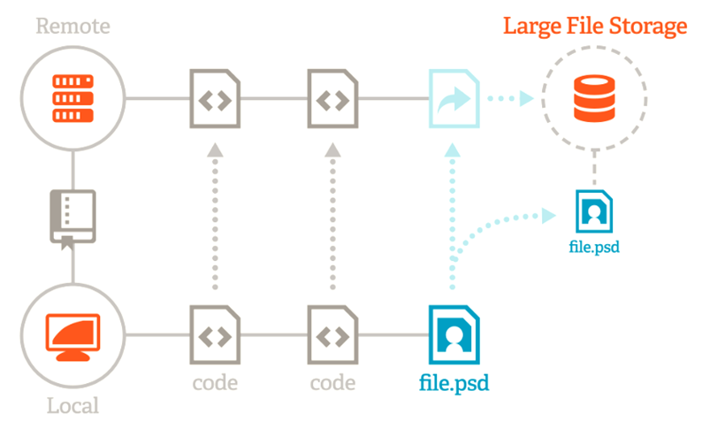
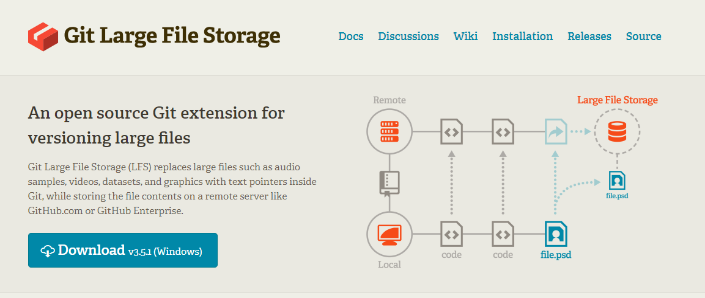
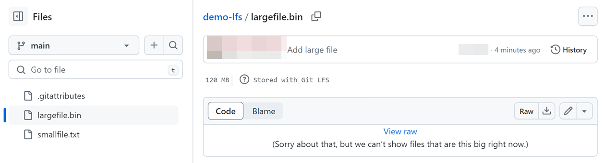
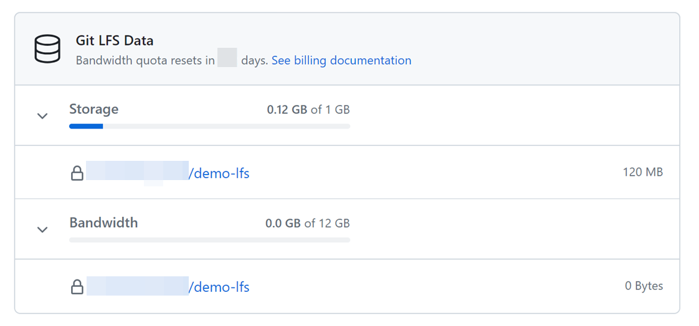
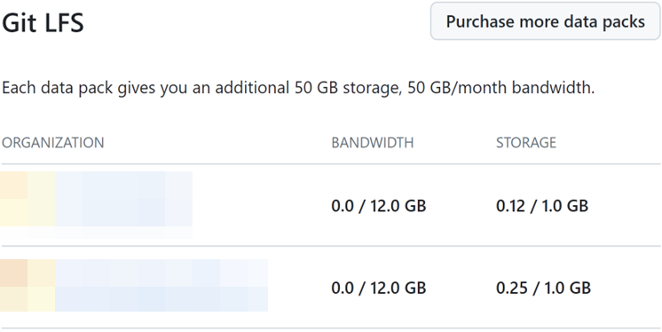

(此文包含提供中文版)

Git LFS (Large File Storage) is an extension of Git designed for managing and storing large files and their change history. In this survey, we will explore different scenarios of using Git LFS, how it works, how to store files, and related quota and billing issues.

## When to Use Git LFS

1. When the file size exceeds 100 MB, you cannot use the `git add` command to upload it directly to GitHub.
2. Files larger than 100 MB need to be stored using Git LFS.

### Example

When we try to push a file larger than 100 MB to GitHub, we encounter the following error:

```
$ git push origin main
remote: error: File largefile.bin is 120.00 MB; this exceeds GitHub's file size limit of 100.00 MB
remote: error: GH001: Large files detected. You may want to try Git Large File Storage - https://git-lfs.github.com.
```

## How Git LFS Works

Git LFS works by using pointer files that point to large files. These pointer files contain metadata about the actual files, not the files themselves. When you need to download a file, the pointer file helps Git find and download the correct file.

GitHub (Remote) stores the pointer files for large files, not the files themselves. The pointer file records information about the actual file to facilitate downloading the correct file.



### Example of Pointer File Content

```
version https://git-lfs.github.com/spec/v1
oid sha256:802d2751b27e699e3d682a4dd2681156b2172d9ab6f93298491ee200d7a32b24
size 128974848
```

## Storing Files Using Git LFS

### Download Git LFS Tool

First, you need to download and install the Git LFS tool.

[Download Git LFS](https://git-lfs.com/)



### Verify Installation

After installation, you can verify if Git LFS is installed correctly with the following command:

```
$ git lfs install
Git LFS initialized.
```

### Specify Files to Use LFS Storage

Here is a demonstration of how to add a large file to a Git repository and specify it to use LFS storage:

```
$ git lfs track *.bin
Tracking "*.bin"
$ git add largefile.bin .gitattributes
$ git commit -m "Add large file"
[main b3b16e2] Add large file
 Date: Wed Jun 5 17:43:16 2024 +0800
 2 files changed, 4 insertions(+)
 create mode 100644 .gitattributes
 create mode 100644 largefile.bin
$ git push origin main
Uploading LFS objects: 100% (1/1), 126 MB | 0 B/s, done.
Enumerating objects: 5, done.
Counting objects: 100% (5/5), done.
Delta compression using up to 4 threads
Compressing objects: 100% (4/4), done.
Writing objects: 100% (4/4), 488 bytes | 488.00 KiB/s, done.
Total 4 (delta 0), reused 0 (delta 0), pack-reused 0
To https://github.com/....../demo-lfs.git
 + 25dd169...ccf16e2 main -> main
```

The above commit performs two actions:

1. Specifies that large files should be stored in LFS.
2. Adds the large file to the repository.

### Exploring LFS Environment Variables

Use the `git lfs env` command to view the LFS environment variable configuration:

```
$ git lfs env
git-lfs/3.0.2 (GitHub; linux amd64; go 1.18.1)
git version 2.34.1

Endpoint=https://github.com/....../demo-lfs.git/info/lfs (auth=none)
LocalWorkingDir=/home/.../demo-lfs
LocalGitDir=/home/.../demo-lfs/.git
LocalGitStorageDir=/home/.../demo-lfs/.git
LocalMediaDir=/home/.../demo-lfs/.git/lfs/objects
ConcurrentTransfers=8
......
UploadTransfers=basic,lfs-standalone-file,ssh
GIT_EXEC_PATH=/usr/lib/git-core
git config filter.lfs.process = "git-lfs filter-process"
git config filter.lfs.smudge = "git-lfs smudge -- %f"
git config filter.lfs.clean = "git-lfs clean -- %f"
```

Note that the LFS server does not have to be GitHub; other servers can also be used.

## Git LFS Scenario Testing

### Scenario Test: Cloning a Repository with Files Stored in LFS Without Git LFS Installed

When we clone a repository with files stored in LFS and do not have Git LFS installed, the pointer file is checked out instead of the actual file.

```
$ git clone  https://github.com/....../demo-lfs.git
Cloning into 'demo-lfs'...
remote: Enumerating objects: 5, done.
remote: Counting objects: 100% (5/5), done.
remote: Compressing objects: 100% (4/4), done.
remote: Total 5 (delta 0), reused 5 (delta 0), pack-reused 0
Receiving objects: 100% (5/5), done.
$ cat demo-lfs/largefile.bin
version https://git-lfs.github.com/spec/v1
oid sha256:802d2751b27e699e3d682a4dd2681156b2172d9ab6f93298491ee200d7a32b24
size 128974848
```

### Scenario Test: Cloning a Repository with Files Stored in LFS with Git LFS Installed

When we clone a repository with files stored in LFS and have Git LFS installed, the files are automatically downloaded from the LFS server without needing to run `git lfs pull` after `git pull` is performed.

```
$ git clone  https://github.com/....../demo-lfs.git
Cloning into 'demo-lfs'...
Remote: Enumerating objects: 5, done.
Remote: Counting objects: 100% (5/5), done.
Remote: Compressing objects: 100% (4/4), done.
Remote: Total 5 (delta 0), reused 5 (delta 0), pack-reused 0
Receiving objects: 100% (5/5), done.
Filtering content: 100% (2/2), 249.00 MiB | 963.00 KiB/s, done.
$ ls –alh demo-lfs
Total 120M
Drwxrwxr-x  3 q q 4.0K Jun 18 14:23 .
Drwxr-x--- 53 q q 4.0K Jun 18 14:25 ..
Drwxrwxr-x  9 q q 4.0K Jun 18 14:23 .git
-rw-rw-r--  1 q q   42 Jun 18 14:19 .gitattributes
-rw-rw-r--  1 q q 120M Jun 18 14:23 largefile.bin
```

### Scenario Test: Running `git pull` After Changing `largefile.bin`

#### Step 1: Update `largefile.bin` on Machine A and Push

First, we update `largefile.bin` on machine A and push it to the repository.

```
$ head -c 130M </dev/urandom >largefile.bin
$ git add largefile.bin && git commit -m 'update largefile.bin'
[main c718000] update largefile.bin
 1 file changed, 2 insertions(+), 2 deletions(-)
$ git push
Uploading LFS objects: 100% (1/1), 136 MB | 1.4 MB/s, done.
Enumerating objects: 5, done.
Counting objects: 100% (5/5), done.
Delta compression using up to 4 threads
Compressing objects: 100% (3/3), done.
Writing objects: 100% (3/3), 442 bytes | 442.00 KiB/s, done.
Total 3 (delta 0), reused 0 (delta 0), pack-reused 0
To https://github.com/....../demo-lfs.git
   a0ccabe..c718000  main -> main
```

#### Step 2: Check MD5 Checksum of the Current File on Machine B Before Pulling

On machine B, we check the MD5 checksum of the current file before pulling.

```
$ ls -alh
total 120M
drwxrwxr-x  3 q q 4.0K Jun 18 14:23 .
drwxr-x--- 53 q q 4.0K Jun 18 14:55 ..
drwxrwxr-x  9 q q 4.0K Jun 18 14:23 .git
-rw-rw-r--  1 q q   42 Jun 18 14:19 .gitattributes
-rw-rw-r--  1 q q 123M Jun 18 14:23 largefile.bin
$ md5sum largefile.bin
197cac7818ae23d532f3691c0f1f897a  largefile.bin
```

#### Step 3: Run `git pull` on Machine B

Run `git pull` on machine B to sync the updated file.

```
$ git pull
remote: Enumerating objects: 5, done.
remote: Counting objects: 100% (5/5), done.
remote: Compressing objects: 100% (3/3), done.
remote: Total 3 (delta 0), reused 3 (delta 0), pack-reused 0
Unpacking objects: 100% (3/3), 422 bytes | 422.00 KiB/s, done.
From https://github.com/....../demo-lfs
   a0ccabe..c718000  main       -> origin/main
Updating a0ccabe..c718000
Fast-forward
 largefile.bin | 4 ++--
 1 file changed, 2 insertions(+), 2 deletions(-)
```

#### Step 4: Check if the MD5 Hash of `largefile.bin` Has Changed

Finally, check if the MD5 hash of the file has changed after syncing.

```
$ md5sum largefile.bin
ef93f725b93f3e4c9ddb0a4c890272ed  largefile.bin
```

The changed MD5 hash indicates that the file has been successfully updated.

## GitHub Interface Overview

### GitHub Marks Files Stored Using LFS

When you store files using Git LFS on GitHub, it marks these files in the interface to indicate that they are stored using Git LFS.



### GitHub Backend Statistics Page

In the GitHub backend, you can see statistics about Git LFS usage. It shows your storage and bandwidth usage.

* Uploads do not consume bandwidth but occupy storage space.



## Quota and Billing

Git LFS usage is calculated separately for each organization, with a default of 1GB outgoing bandwidth and 1GB storage space per month.



### How to Purchase Quota Expansion

GitHub offers a quota expansion option called "data pack." Each data pack provides an additional 50GB of storage space and 50GB of outgoing bandwidth per month.


---

Git LFS (Large File Storage) 是一個 Git 擴展，用於管理和存儲大型文件及其變更記錄。在這次的調查中，我們將探討使用 Git LFS 的不同情境、運作方式、如何存放檔案以及相關的配額和計費問題。


## 什麼情況需要使用 Git LFS

1. 當文件大小超過 100 MB 時，無法直接使用 `git add` 命令上傳至 GitHub。
2. 超過 100 MB 的檔案需要使用 Git LFS 進行儲存。

### **示例**

當我們嘗試將超過 100 MB 的文件 push 到 GitHub 時，會遇到如下錯誤：

```
$ git push origin main
remote: error: File largefile.bin is 120.00 MB; this exceeds GitHub's file size limit of 100.00 MB
remote: error: GH001: Large files detected. You may want to try Git Large File Storage - https://git-lfs.github.com.
```

## Git LFS 運作方式

Git LFS 通過使用指向大文件的指針文件（Pointer Files）來工作，這些指針文件包含實際文件的元數據，而非文件本身。當需要下載文件時，指針文件會幫助 Git 找到並下載正確的文件。

GitHub (Remote) 儲存大檔案的指針文件，非檔案本身。 Pointer file 紀錄實際檔案的資訊，以便下載到正確檔案。


### Pointer Files 內容範例

```
version https://git-lfs.github.com/spec/v1
oid sha256:2e208b1b54386752ff5dadd7391645817b7c7286fa0c72fb0c3dccb217c275db
size 128974848
```

## 使用 Git LFS 存放檔案

### 下載 Git LFS 工具

首先，您需要下載並安裝 Git LFS 工具。

[下載 Git LFS](https://git-lfs.com/)


### 驗證安裝

安裝完成後，可以通過以下命令來驗證安裝是否成功：

```
$ git lfs install
Git LFS initialized.
```

### 將檔案指定使用 LFS 儲存

以下是一個示範，說明如何將大檔案加入到 Git repo 並指定使用 LFS 儲存：

```
$ git lfs track *.bin
Tracking "*.bin"
$ git add largefile.bin .gitattributes
$ git commit -m "Add large file"
[main b3b16e2] Add large file
 Date: Wed Jun 5 17:43:16 2024 +0800
 2 files changed, 4 insertions(+)
 create mode 100644 .gitattributes
 create mode 100644 largefile.bin
$ git push origin main
Uploading LFS objects: 100% (1/1), 126 MB | 0 B/s, done.
Enumerating objects: 5, done.
Counting objects: 100% (5/5), done.
Delta compression using up to 4 threads
Compressing objects: 100% (4/4), done.
Writing objects: 100% (4/4), 488 bytes | 488.00 KiB/s, done.
Total 4 (delta 0), reused 0 (delta 0), pack-reused 0
To https://github.com/....../demo-lfs.git
 + 2fbd197...b3b16e2 main -> main
```

以上 commit 執行了兩個動作：

1. 指定大檔案要存到 LFS 內
2. 將大檔案 add 到 repo

### 探索：LFS 環境變數

使用 `git lfs env` 命令查看 LFS 的環境變數配置：

```
$ git lfs env
git-lfs/3.0.2 (GitHub; linux amd64; go 1.18.1)
git version 2.34.1

Endpoint=https://github.com/....../demo-lfs.git/info/lfs (auth=none)
LocalWorkingDir=/home/.../demo-lfs
LocalGitDir=/home/.../demo-lfs/.git
LocalGitStorageDir=/home/.../demo-lfs/.git
LocalMediaDir=/home/.../demo-lfs/.git/lfs/objects
ConcurrentTransfers=8
......
UploadTransfers=basic,lfs-standalone-file,ssh
GIT_EXEC_PATH=/usr/lib/git-core
git config filter.lfs.process = "git-lfs filter-process"
git config filter.lfs.smudge = "git-lfs smudge -- %f"
git config filter.lfs.clean = "git-lfs clean -- %f"

```

值得注意的是，LFS 的伺服器不一定要是 GitHub，也可以使用其他伺服器。

## Git LFS 情境測試

### 情境測試：未安裝 git lfs，clone 檔案儲存在 LFS 的 repo

當我們 clone 一個儲存在 LFS 的 repo 並未安裝 git lfs 時，檢出的是 pointer file，而非檔案本身。

```
$ git clone  https://github.com/....../demo-lfs.git
Cloning into 'demo-lfs'...
remote: Enumerating objects: 5, done.
remote: Counting objects: 100% (5/5), done.
remote: Compressing objects: 100% (4/4), done.
remote: Total 5 (delta 0), reused 5 (delta 0), pack-reused 0
Receiving objects: 100% (5/5), done.
$ cat demo-lfs/largefile.bin
version https://git-lfs.github.com/spec/v1
oid sha256:2e208b1b54386752ff5dadd7391645817b7c7286fa0c72fb0c3dccb217c275db
size 128974848
```


### 情境測試：安裝 git lfs 後，clone 檔案儲存在 LFS 的 repo

當我們 clone 一個儲存在 LFS 的 repo 並安裝了 git lfs 時，檔案會自動從 LFS 伺服器下載，不須執行 `git lfs pull`。

```
$ git clone  https://github.com/....../demo-lfs.git
Cloning into ‘demo-lfs’…
Remote: Enumerating objects: 5, done.
Remote: Counting objects: 100% (5/5), done.
Remote: Compressing objects: 100% (4/4), done.
Remote: Total 5 (delta 0), reused 5 (delta 0), pack-reused 0
Receiving objects: 100% (5/5), done.
Filtering content: 100% (2/2), 249.00 MiB | 963.00 KiB/s, done.
$ ls –alh demo-lfs
Total 120M
Drwxrwxr-x  3 q q 4.0K Jun 18 14:23 .
Drwxr-x--- 53 q q 4.0K Jun 18 14:25 ..
Drwxrwxr-x  9 q q 4.0K Jun 18 14:23 .git
-rw-rw-r--  1 q q   42 Jun 18 14:19 .gitattributes
-rw-rw-r--  1 q q 120M Jun 18 14:23 largefile.bin
```


---

### 情境測試：在變更 largefile.bin 後，執行 git pull

#### Step 1: 在 A 機器更新 largefile.bin 並 push

首先，我們在機器 A 上更新 largefile.bin，然後推送到儲存庫。

```
$ head -c 130M </dev/urandom >largefile.bin
$ git add largefile.bin
$ git commit -m 'update largefile.bin'
[main c718bd4] update largefile.bin
 1 file changed, 2 insertions(+), 2 deletions(-)
$ git push
Uploading LFS objects: 100% (1/1), 136 MB | 1.4 MB/s, done.
Enumerating objects: 5, done.
Counting objects: 100% (5/5), done.
Delta compression using up to 4 threads
Compressing objects: 100% (3/3), done.
Writing objects: 100% (3/3), 442 bytes | 442.00 KiB/s, done.
Total 3 (delta 0), reused 0 (delta 0), pack-reused 0
To https://github.com/....../demo-lfs.git
   a0ea1be..c718bd4  main -> main
```

#### Step 2: 在機器 B 執行 git pull 前，確認目前檔案的 MD5 checksum

在機器 B 上，我們在 pull 之前先確認目前檔案的 MD5 checksum。

```
$ ls -alh
total 120M
drwxrwxr-x  3 q q 4.0K Jun 18 14:23 .
drwxr-x--- 53 q q 4.0K Jun 18 14:55 ..
drwxrwxr-x  9 q q 4.0K Jun 18 14:23 .git
-rw-rw-r--  1 q q   42 Jun 18 14:19 .gitattributes
-rw-rw-r--  1 q q 123M Jun 18 14:23 largefile.bin
$ md5sum largefile.bin
256c76c42403a6b5010ac1fa2c2ae682  largefile.bin
```

#### Step 3: 在 B 機器執行 git pull

在 B 機器上執行 git pull，同步更新檔案。

```
$ git pull
remote: Enumerating objects: 5, done.
remote: Counting objects: 100% (5/5), done.
remote: Compressing objects: 100% (3/3), done.
remote: Total 3 (delta 0), reused 3 (delta 0), pack-reused 0
Unpacking objects: 100% (3/3), 422 bytes | 422.00 KiB/s, done.
From https://github.com/....../demo-lfs
   a0ea1be..c718bd4  main       -> origin/main
Updating a0ea1be..c718bd4
Fast-forward
 largefile.bin | 4 ++--
 1 file changed, 2 insertions(+), 2 deletions(-)
```

#### Step 4: 確認 largefile.bin 的 MD5 hash 是否有變

最後，我們確認同步後檔案的 MD5 hash 是否有變。

```
$ md5sum largefile.bin
b797fa1b977f1e6fe12ef31070e10840  largefile.bin
```

確認 MD5 hash 有變，表示文件已成功更新。

## GitHub 介面，簡單帶過

### GitHub 會特別標註使用 LFS 儲存的檔案

當您在 GitHub 上使用 LFS 儲存檔案時，GitHub 會在介面中特別標註，告訴您這個檔案是使用 Git LFS 儲存的。


### GitHub 後台統計數據畫面

在 GitHub 的後台，可以看到 Git LFS 的統計數據。這裡會顯示您的存儲和帶寬使用情況。

* 上傳不吃頻寬，但會佔用儲存空間。


## Quota 和計費

Git LFS 的使用量是每個 organization 分開計算的，每個月預設給 1GB outgoing 流量和 1GB 儲存空間。


### 擴充 quota 的購買方式

GitHub 提供擴充 quota 的購買選項，稱為 "data pack"。每個 data pack 提供額外 50GB 儲存空間和每月 50GB outgoing 流量。


--------------

