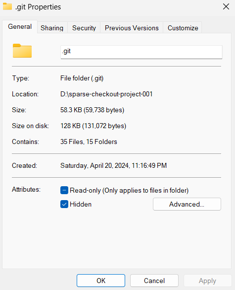

## Scenario and Problems sparse-checkout Tries to Solve

Imagine a huge Git repository with the following characteristics:

- The root directory contains several project folders, unrelated to each other.
    - For example, `project-001` will never need the contents of the folders from `project-002` to `project-100`.
- The repository contains thousands to tens of thousands of files.
- The total size of the repository reaches 100GB.

Structure Example:

```
very-large-repo
├── project-001/
│   ├── file1.txt
│   └── file...
├── project-002/
│   ├── file1.txt
│   └── file...
├── project-003/
│   ├── file1.txt
│   └── file...
...
└── project-100/
    ├── file1.txt
    └── file...
```

Originally, Git was designed to have everyone maintain a complete copy of the repository. Therefore, early on, even if I was only responsible for project-001, which totaled only 10MB, a `git clone/pull` would require copying up to 100GB of files from `project-001` ~ `project-100` to my computer, significantly slowing down commit speed.

Recent versions of Git offer the sparse-checkout feature, which allows downloading only project-001 without needing to download other directory contents.

## Testing Conditions

### Testing Objective

Verify that sparse-checkout effectively reduces disk usage.

### Testing Method

Using the repository shown below, the following situations were tested for occupied disk space:

- Full checkout (without using sparse-checkout)
- Only retrieving a small project folder (using sparse-checkout for the `project-001`, about 44K)
- Only retrieving a large project folder (using sparse-checkout for the `project-very-large-files`, about 751M)

```
sparse-checkout-sample
├─ create-files.sh
├── project-001/ (44K)
│   ├── project-001-subdir (24K)
|   |   └── files...
│   └── files...
├── project-002/ (84K)
│   └── files...
├── project-003/ (88K)
│   └── files...
└── project-very-large-files/ (751M)
    └── files...
```

### Testing Conditions
- Testing date: April 19, 2024
- Testing environment:
    - OS: Windows 11
    - Git client: version 2.40.1.windows.1
    - SCM platform: GitHub
      - repo: https://github.com/ukewea/sparse-checkout-sample

## Let's Test!

### Baseline Test: Cloning Entire Content

Without using sparse-checkout, the command is as follows:

```bash
git clone https://[__PAT__]@github.com/ukewea/sparse-checkout-sample
```

Enter the repo, confirming it contains all files.

```
PS D:\sparse-checkout-sample> ls

    Directory: D:\sparse-checkout-sample

Mode                 LastWriteTime         Length Name
----                 -------------         ------ ----
d----           4/20/2024 11:10 PM                project-001
d----           4/20/2024 11:10 PM                project-002
d----           4/20/2024 11:10 PM                project-003
d----           4/20/2024 11:10 PM                project-very-large-files
-a---           4/20/2024 11:10 PM             68 .gitattributes
-a---           4/20/2024 11:10 PM           2353 create-files.sh
```

Check `.git` folder size: approximately 750 MB.


### sparse-checkout: Retrieving a Small Project Folder

Execute the command to only check out project-001:

```bash
git clone --filter=blob:none --sparse https://[__PAT__]@github.com/ukewea/sparse-checkout-sample sparse-checkout-project-001
cd sparse-checkout-project-001
git sparse-checkout set "project-001"
```

Observe that only the root directory files and the `project-001` are checked out.

Check `.git` folder size: approximately 58 KB, showing a significant reduction in space occupation.



### sparse-checkout: Retrieving a Large Project Folder

Execute the command to only check out large-dir:

```bash
git clone --filter=blob:none --sparse https://[__PAT__]@github.com/ukewea/sparse-checkout-sample sparse-checkout-sample-project-very-large-files
cd sparse-checkout-sample-project-very-large-files
git sparse-checkout set "project-very-large-files"
```

Observe that only the root directory files and the `project-very-large-files` folder are checked out.

Check `.git` folder size: approximately 802 MB.


The experiments prove that sparse-checkout significantly reduces disk usage. The .git folder size adjusts based on the sparse-checkout filter settings, only retrieving relevant content instead of downloading all repo content before extracting a small amount to the filesystem.

## Post sparse-checkout Commit Testing
- Testing environment: same as above.
- Testing method: After adding files in individual project folders, verify if add, commit, push, and fetch functions differ from a regular repo.
- Testing process: omitted.
- Testing results: Operations are the same as with a non-sparse-checkout repo, with no difference in user experience.

## Script for Creating a sparse-checkout Sample Repository

I used the script below to create a sample repository to do the testing with, if you want to create your own repository for testing purposes, you can use this script as a reference.

You have to initialize a new git repository, then put the script below in the root directory of the repository. Then, run the script to create the sample repository with the required file structure and content.

```bash
#!/bin/bash

# Define the base path to your git repository
REPO_PATH="."

# Define the folder paths
FOLDER_A="$REPO_PATH/project-001"
FOLDER_A_SUBDIR="$REPO_PATH/project-001/project-001-subdir"
FOLDER_B="$REPO_PATH/project-002"
FOLDER_C="$REPO_PATH/project-003"
FOLDER_LARGE="$REPO_PATH/project-very-large-files"

# Ensure the folders exist
mkdir -p "$FOLDER_A" "$FOLDER_B" "$FOLDER_C" "$FOLDER_LARGE"

# Change to the repository directory
cd "$REPO_PATH"

# Function to add and commit files in a specified folder
commit_files() {
  local folder_path=$1
  local start_index=$2
  local end_index=$3

  for i in $(seq $start_index $end_index); do
    # Create a dummy file with a unique name
    echo "This is dummy file $i in $(basename $folder_path)" > "$folder_path/dummy_file_$i.txt"

    # Add the file to the Git repository
    git add "$folder_path/dummy_file_$i.txt"

    # Commit the file with a unique commit message
    git commit -m "Add dummy file $i in $(basename $folder_path)"
  done
}

# Function to create a large file and commit it with unified signature
create_large_files() {
  local folder_path=$1
  local start_index=$2
  local end_index=$3
  local size_mb=$4  # Size in megabytes for each file

  for i in $(seq $start_index $end_index); do
    local file_name="large_file_$i.dat"
    local file_path="$folder_path/$file_name"

    # Create a file of specified size using 'dd'
    dd if=/dev/urandom of="$file_path" bs=1M count=$size_mb iflag=fullblock

    # Add and commit the file
    git add "$file_path"
    git commit -m "Add $file_name, size ${size_mb}MB"
  done
}

mkdir "$FOLDER_A"
mkdir "$FOLDER_A_SUBDIR"
mkdir "$FOLDER_B"
mkdir "$FOLDER_C"
mkdir "$FOLDER_LARGE"

# Perform the required file creations and commits
commit_files "$FOLDER_A" 1 5
commit_files "$FOLDER_B" 6 10

create_large_files "$FOLDER_LARGE" 1 5 50

commit_files "$FOLDER_C" 11 15
commit_files "$FOLDER_B" 16 20

create_large_files "$FOLDER_LARGE" 6 10 50

commit_files "$FOLDER_A" 21 25

commit_files "$FOLDER_A_SUBDIR" 26 30

commit_files "$FOLDER_B" 31 35
commit_files "$FOLDER_C" 36 40

create_large_files "$FOLDER_LARGE" 11 15 50

commit_files "$FOLDER_A" 41 45
commit_files "$FOLDER_B" 46 50

echo "Commits and file creations have been performed as requested."
```