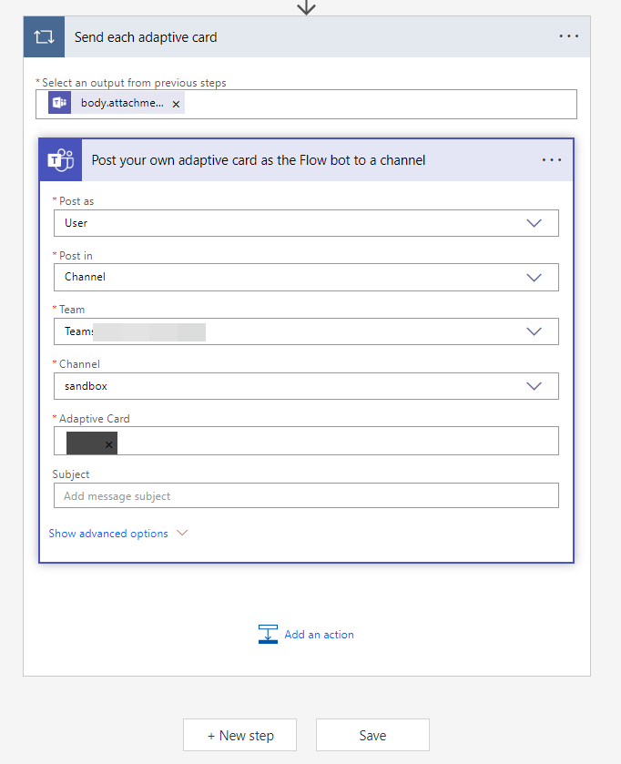

I've been using incoming webhook provided in O365 connector to receive custom notification in my corporate's channels in Microsoft Teams, one day a line of text is appended under the message, it says:

> **Action Required**: O365 connectors within Teams will be deprecated and notifications from this service will stop. [Learn more](https://devblogs.microsoft.com/microsoft365dev/retirement-of-office-365-connectors-within-microsoft-teams/) about the timing and how the Workflows app provides a more flexible and secure experience. If you want to continue receiving these types of messages, you can use a workflow to post messages from a webhook request. Set up workflow


So, I needed to migrate my webhook notifications from O365 connectors to Workflows app. And I've had trouble finding the right documentation to do so. Here's how I did it:

1. First, right click on the team you want to migrate the webhook to, and select `Workflows` in the menu.

   

2. In the dialog that pops up, choose `Post to a channel when a webhook request is received`.

   

3. You'll be asked to provide a name for the workflow. I used the default name.

   In the same step, you'll be asked the "Connections" to use, this will be the account that will post the messages to the channel. Click on the dots next to the "Microsoft Teams" and a selection of accounts will appear. Choose the account you want to use, I chose a separate utility account (a service account) for this purpose.

   

4. Then you'll be asked to provide a channel to post the messages to. Choose the channel you want to post the messages to.

   Click `Add workflow` to finish the setup.

   

5. Copy the webhook URL that is generated for you, then click `Done`

   

---

Initially I thought this is all I need to be able to migrate my webhook notifications from O365 connectors to Workflows app. But in fact the following also needs to be migrated:

1. The user on behalf of whom the notifications are sent.
2. The webhook URL that I used to send the notifications to.
3. The format of the payload is different.

Let's start with the first one.

### Change the user on behalf of whom the notifications are sent

After I done the steps above, I tried to send a notification to the webhook URL generated by the Workflows app, but I keep getting 403 error. Reviewing the History of the workflow, I see the following error:

```json
{
    "statusCode": 403,
    "headers": {
        // omitted
    },
    "body": {
        "error": {
            "code": "BotRequestFailed",
            "message": "Request to the Bot framework failed with error: '{\"error\":{\"code\":\"BotNotInConversationRoster\",\"message\":\"The bot is not part of the conversation roster.\"}}'."
        }
    }
}
```

Some Internet research told me: in public channel, Workflow is able to send message with the "Flow Bot" (Added when the Workflow app is added to the team), but in private channel, Workflow is unable to send message with the "Flow Bot".

To solve this, I have to change the user on behalf of whom the notifications are sent:

1. Right click on the team you just created the workflow to, and select `Workflows`.
   In the popup dialog, click `Manage`.

   

2. You'll then redirected to the Workflows app. Click on the name of the workflow you just created.

   

3. Click on the `Edit` button on the top row.

   

4. Click on `Send each adaptive card`.

   

5. Click  `Post your own adaptive card as the Flow bot to the channel`.

   

6. This is the place where you can change the user on behalf of whom the notifications are sent.

   

7. Click on the arrow of the `Post as` and choose `User`.

   

8. Click `Save` to save the changes.

   

### Update the webhook URL

Remember to change the webhook URL in your code to the one generated by the Workflows app.

### Change the payload format

The payload (body in HTTP request) that I used to send to the O365 connector webhook is like this:

```json
{
  "text": "This is a text",
}
```

But the payload that I need to send to the Workflows app is like below, the main difference is that you have to send an Adaptive Card as the body of the request:

```json
{
  "type": "message",
  "attachments": [
    {
      "contentType": "application/vnd.microsoft.card.adaptive",
      "contentUrl": null,
      "content": {
        "$schema": "http://adaptivecards.io/schemas/adaptive-card.json",
        "type": "AdaptiveCard",
        "version": "1.4",
        "body": [
          {
            "type": "TextBlock",
            "text": "This is a text",
          },
        ],
      },
    }
  ],
}
```

You can visit [the official documentation](https://adaptivecards.io/explorer/TextBlock.html) for more available components in Adaptive Card.

---

After all these steps, I was able to successfully migrate my webhook notifications from O365 connectors to Workflows app. I hope this guide helps you to do the same.

