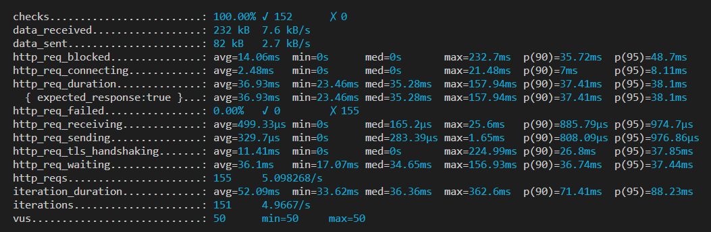
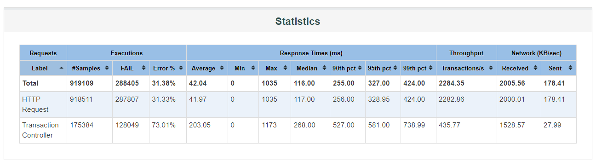
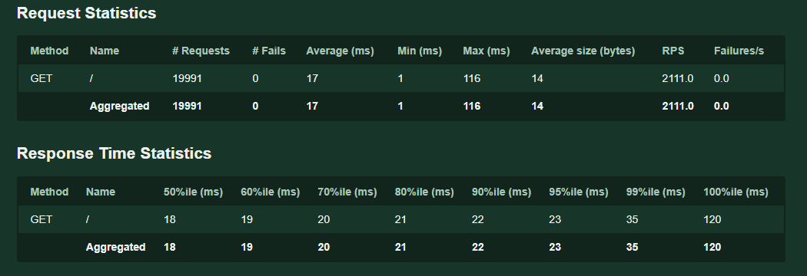

## What this is not?

This **is not a test to check if the features are functioning correctly** (that type of test is called a functional test, such as verifying if pressing Button A pops up Dialog B displaying Table C).

Please ensure the functionality is correct in other ways first (e.g., unit tests, API tests) before running performance tests.

## What is this?

Ensure the API or system **operates normally under expected traffic** and identify potential issues and system limitations under abnormal traffic.

## Questions Before Diving Into Performance Testing

Before deciding to write a test or choosing a tool, you should be able to answer the following questions:

1. Load specifications?
2. What processes or components to test?
3. How to run the test: What are the conditions under which you are testing the process or component (normal conditions or sudden influx of traffic)?
4. What is considered "acceptable performance"?

To achieve the level of testing shown in the diagram below, we first need to know "where the load specifications are" and then decide "what is acceptable performance."

## How to Define "Load Specifications"

This refers to the demand you expect the system to handle. "Specifications" include but are not limited to:

1. **Number of users**: How many users do you expect to use the application or system simultaneously? If you are developing an online store, you might try to estimate how many people might visit simultaneously during specific times (like Black Friday or Singles' Day).
2. Number of transactions or **operations**: How many transactions or operations do you expect each user to perform? For example, users might simultaneously search for products, add items to their shopping carts, and proceed to checkout.
3. Data volume: How much data does the application need to process or transmit? For database-intensive applications, this might include reading or writing a large amount of data.
4. **Frequency**: What is the frequency of operations or transactions? For example, an API might be called several hundred times per second.

## Test Design and Execution

Once you can answer the above questions, an API testing strategy might follow these steps:

- **Write test scripts**: Write user flows, parameterize test data, and group URLs.
- **Assert performance and correctness**: Use Checks to assert system responses and use Thresholds to ensure the system operates within your service level objectives (SLOs).
- **Model and generate load**: Choose the appropriate executor to accurately simulate the workload that meets your testing goals. Make sure the load generator is properly positioned.
- **Repeatedly test your test suite**: Over time, you can reuse script logic (such as user login processes or throughput configurations). You will also be able to perform tests that are broader in scope or part of an automated test suite.

## Types of Performance Testing Covered in This Document

- Load testing: Testing within system specifications.
- Stress testing: Testing beyond system specifications.
- Soak testing: Long-duration testing within system specifications to identify problems that only manifest over time, e.g., memory leaks.

## Metrics

When conducting load tests, there are several key metrics to monitor that can help you understand your system's performance under expected loads. Here are some common metrics:

**1. Throughput**: This is the number of requests the system can handle within a given time. This is an important metric because it can show how much workload your system can handle under pressure.

**2. Error Rate**: This is the rate at which the system encounters errors when processing requests. If the error rate is too high, it might indicate that your system cannot operate normally under stress.

**3. Average Load Time**: This is the average time it takes for the system to complete a request, i.e., from the time the request is sent to the time a response is received.

**4. Concurrent Users**: This is the maximum number of users the system can handle at any given time.

**5. Resource Utilization**: This is how much the system's resources (such as CPU, memory, disk I/O, etc.) are being used under pressure.

Please note that since performance testing tools are just HTTP clients, **"resource utilization" cannot be obtained through these tools** and must be collected from the server using other methods.

## Tools Trial: k6 - Output

- `http_req_receiving`: Time taken for the HTTP request to **respond** from the server.
- `http_req_sending`: Time taken to **send** the HTTP request to the server.
- `http_req_waiting`: Time taken for the HTTP request to **wait for a response** from the server.
- `http_req_duration`: Total time of an HTTP request (`http_req_sending` + `http_req_waiting` + `http_req_receiving`).
- `http_req_failed`: Proportion of failed HTTP requests (default status code is 200, but you can use [expectedStatuses](https://k6.io/docs/javascript-api/k6-http/expectedstatuses-statuses) for specific judgments).
- `iteration_duration`: Time taken for one execution of the script.
- `http_reqs`: Total number of HTTP requests sent during the test.
- `iterations`: Total number of test rounds conducted.

## Tools Trial: JMeter - Output

Focus on Execution - Samples (number of sends), Response Times (ms) - Average (response time).

## Tools Trial: Locust - Output

Focus on # Requests, 90%ile (ms).

## Which testing tool will I continue to integrate into the CI/CD pipeline, and why?

From the screenshots above, it can be seen that k6, JMeter, and Locust all yield similar data, but what about other aspects?

| Item                            | JMeter                                                                    | Locust                                                       | k6                                                                                            |
| ------------------------------- | ------------------------------------------------------------------------- | ------------------------------------------------------------ | --------------------------------------------------------------------------------------------- |
| Implementation Language         | Java                                                                      | Python                                                       | Go                                                                                            |
| Test Design Method              | GUI + some scripting                                                      | Pure scripting                                               | Pure scripting                                                                                |
| Save Format                     | .jmx                                                                      | .py                                                          | .js                                                                                           |
| Collaboration                   | Poor (automatically generated files, hard to resolve conflicts)           | Good (pure .py files)                                        | Good (pure .js files)                                                                         |
| Scripting Language              | Java                                                                      | Python                                                       | JavaScript                                                                                    |
| Plugin                          | jar files, may encounter JDK version issues                               | Python module                                                | JS module, Go module                                                                          |
| External Dependencies           | Java                                                                      | Python                                                       | None                                                                                          |
| System Resource Usage           | Poor                                                                      | Moderate                                                     | Good                                                                                          |
| Load Generation per Node        | Low                                                                       | Low                                                          | High                                                                                          |
| AI Assistance Potential         | Poor (GUI generated XML cannot be used with ChatGPT for generating tests) | Good, can use ChatGPT & Copilot to generate and explain code | Good, can use ChatGPT & Copilot to generate and explain code                                  |
| Number of Developers Who Script | Few                                                                       | Moderate                                                     | Many                                                                                          |
| Entry Barrier                   | Low-Medium: GUI lowers barrier, but Java scripting requires familiarity   | High: Requires learning Python syntax                        | Medium: No GUI, but if AP developers are also handling front-end, no need to learn JavaScript |
| Reporting Format                | console  HTML  other 3rd party plugin                         | console  HTML  other 3rd party plugin            | console  HTML (3rd party)  Grafana  other 3rd party plugin                  |
