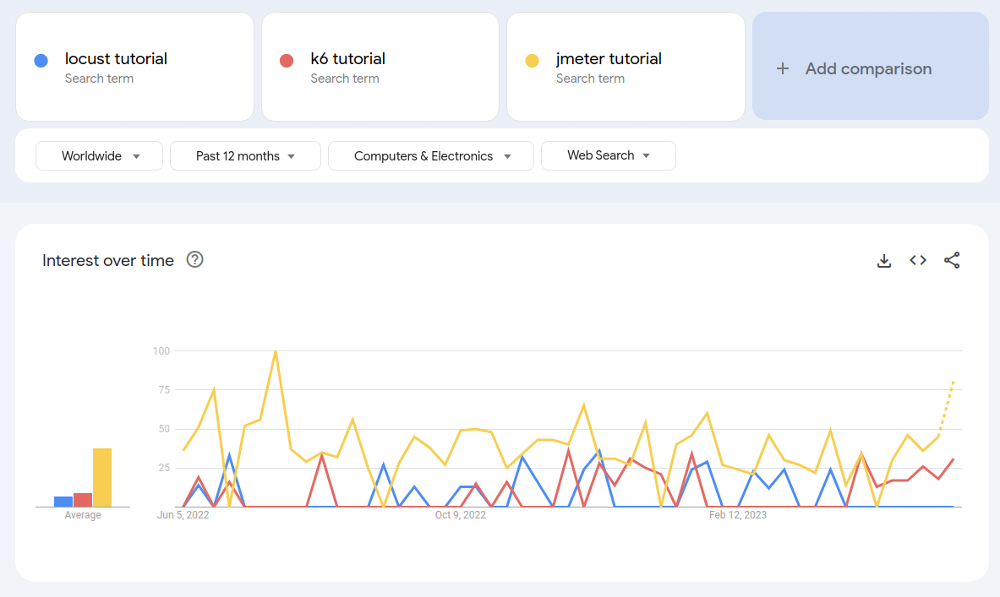
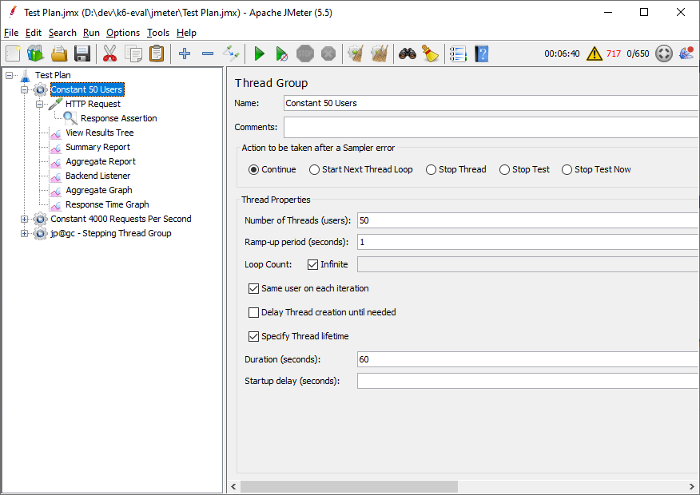
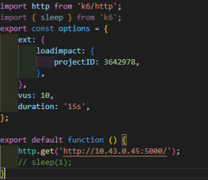
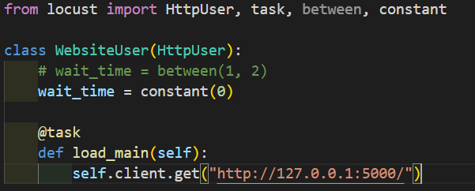
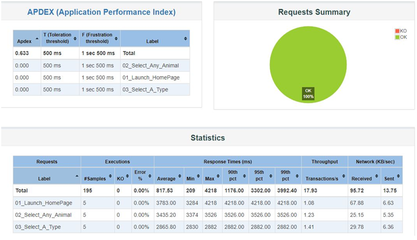
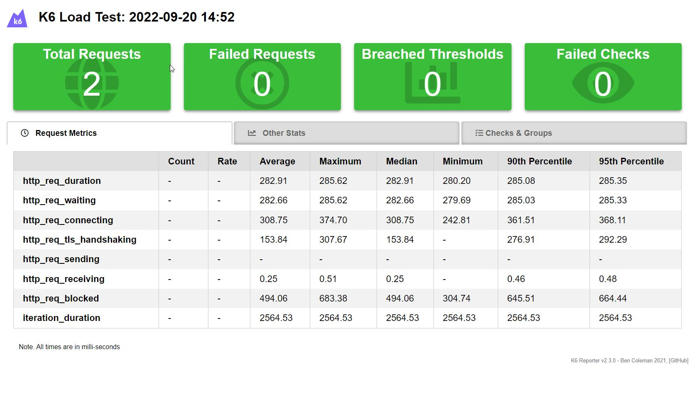
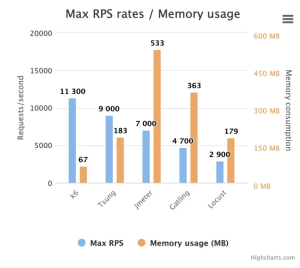

We've covered the basic of performance testing in the [previous article](../performance-testing-intro/), now we would like to compare to some testing performance testing tools.

## What is Performance Testing (Again)

Before we delve into the topic, let's do a review

After ensuring that a system's functionality (e.g., pressing button A should pop up dialog B displaying table C) matches the specifications outlined in documents like SA/SD, we may want to know how the system performs when 100, or even 1000 or 10000, people use it simultaneously. This need leads to performance testing.

Performance testing can be conducted in several ways, including:

- **Load Testing**: This involves simulating the expected load (as outlined in specifications) to verify if the system operates correctly under multiple simultaneous user accesses.
- **Stress Testing**: This tests how the system behaves when it operates beyond the expected maximum load.
- **Soak Testing**: This checks whether the system operates normally under continuous expected loads for an extended period, to see if issues like memory leaks occur.

Performance testing is a type of non-functional test, meaning it does not verify if the functions meet expectations (that's what functional tests like unit tests or integration tests ensure).

## What These Tools Do and Why Compare Them

When conducting performance tests, such as load testing or stress testing, the process is as follows:

1. **Setting Functional Requirements**: For instance, the "view pending approvals" service should handle 100 users simultaneously with each request responding no longer than 3 seconds.

2. **Setting Up the Testing Approach**: Common strategies include:

    - Focusing on the **number of users** and its impact on the system.
    - Focusing on the **number of requests** per second and its effect.
    - Focusing on the **amount of data** being processed and its impact.

3. **Implementing the Test**:

    - Using tools to access the service in a prescribed manner.
    - Implementing mechanisms to collect data on server resource usage.

4. **Collecting and Evaluating Test Results**: Analyzing the data generated during the tests.

**This article primarily evaluates the 'tools' i.e., the third part the steps listed above.**

## Tool Introduction

**JMeter**:

- Released in 1998
- Developed in Java
- Initially unmatched by any similar open-source tool
- Features a GUI for dragging and dropping to create complete test cases
- Supports various protocols (HTTP, FTP, SMTP, etc.)
- Available third-party plugins

**k6**:

- Launched in 2017
- Developed in Go
- Supports "test as code," meaning you can write test cases in a text editor, even using tools like GitHub Copilot to generate parts of the test cases
- Supports modern protocols, like HTTP/2, natively

**Locust**:

- Developed in Python
- Also supports "test as code," allowing complete test cases to be written in a text editor
- Familiar to those proficient in Python

## Commonalities

- All three tools can perform the following tests:
    - Focus on how variations in user numbers affect the system.
    - Focus on how the number of requests impacts the system.
    - Focus on how the amount of data affects the system.
- Compatible with Linux/Windows.
- Can be integrated into CI/CD pipelines.
- Support distributed testing, using multiple machines to simulate access, ideal for rigorous tests like stress testing.
- Free to use and actively maintained with updates over the last year.
- Third-party plugins are available (though specifics vary).

## Differences

### Popularity Online

Using the keyword "{tool name} tutorial" in Google Trends, JMeter is more well-known.

### Implementation of Tests

- **JMeter**: Uses a GUI to design tests, producing a .jmx file in XML format.
    - 
- **k6**: Designs tests using JavaScript, appealing to those familiar with JavaScript.
    - 
- **Locust**: Uses Python to design tests.
    - 

## Report Generation Format

- **JMeter**: Can view results directly in the GUI and generate HTML reports.
    - GUI results are not helpful for CI/CD as the GUI cannot be used during automated test execution. It is recommended not to use the GUI when running tests.
    - 
- **k6**: Built-in CSV, JSON outputs, with plugins available for HTML report generation.
    - 
    - k6 supports official plugins for sending test statistics to time series databases like InfluxDB for visualization with Grafana.
- **Locust**: Has built-in CSV output, with fewer options for other report formats found online.

## Performance

According to [https://k6.io/blog/k6-vs-jmeter/](https://k6.io/blog/k6-vs-jmeter/) and potential personal benchmarks, k6 outperforms the other tools with higher request rates under lower memory usage.

## Installation and Setup

- **JMeter**: Requires a Java runtime environment, which can be a constraint if fewer people are familiar with Java in your organization.
- **Locust**: Requires a Python runtime environment.
- **k6**: Requires no installation (single executable, thanks to Go's static linking).

## Which Tool to Recommend

## Background Analysis

(Reserved content for internal use)

## Perspective of Test Writers

(Reserved content for internal use)

## Perspective of CI/CD Integrators

(Reserved content for internal use)

## Perspective of Resource Constraints

(Reserved content for internal use)

In conclusion, k6 is generally recommended across various aspects, balancing ease of use, modern integration capabilities, and performance.