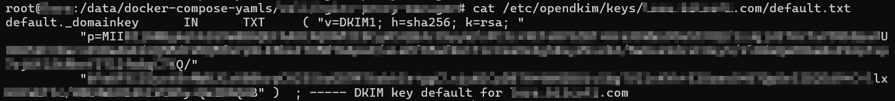
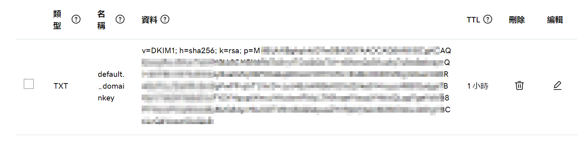
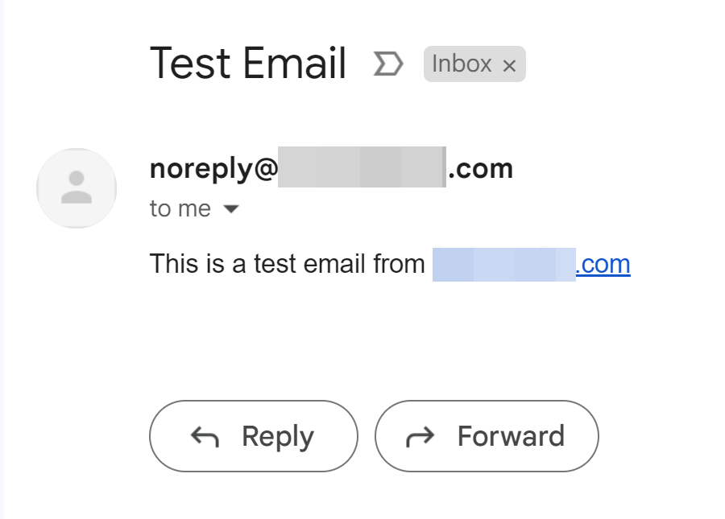

Here's a guide to set up Postfix as an SMTP server that only allows local connections (from Docker containers and the local host). We'll also set up OpenDKIM for DKIM signatures.

## Setup

### Set some variables

```bash
export MAIL_HOSTNAME=__domain_name__

# format: {machine-name}_{sequence number}_{comment or subdomain}
# if no comment or subdomain, leave empty, like below
# sequence number is used to avoid conflict with other postfix instances on the same machine
export DKIM_SELECTOR=server01_01_
```

### Install necessary packages

```bash
sudo apt update && sudo apt install -y postfix opendkim opendkim-tools
```

During the Postfix installation process, choose the following options:
- General type of mail configuration: `Internet Site`
- System mail name: `{MAIL_HOSTNAME you just set}`

### Change IPs allowed to connect to Postfix

Edit `/etc/postfix/main.cf`:

```
sudo vi /etc/postfix/main.cf
```

Allow private IPs to connect, this will also allow Docker containers (which IPs are 172.x.x.x) to connect:

```
mynetworks = 127.0.0.0/8 [::ffff:127.0.0.0]/104 [::1]/128 172.16.0.0/12
inet_interfaces = all
inet_protocols = all
```

### Configure OpenDKIM

1. Create the DKIM keys directory:

```bash
sudo mkdir -p /etc/opendkim/keys/${MAIL_HOSTNAME}
```

2. Generate the DKIM keys:
(If you need multiple mail server on different machines using same domain, remember change 'default' to other text on other machine, or you will encounter problem setting DNS record)

```bash
sudo opendkim-genkey -b 2048 -d ${MAIL_HOSTNAME} -D /etc/opendkim/keys/${MAIL_HOSTNAME} -s ${DKIM_SELECTOR} -v
```

3. Set permissions:

```bash
sudo chown -R opendkim:opendkim /etc/opendkim
sudo chmod go-rw /etc/opendkim/keys/${MAIL_HOSTNAME}/${DKIM_SELECTOR}.private
```

4. Edit `/etc/opendkim.conf`:

```bash
sudo vi /etc/opendkim.conf
```


Add or modify the following lines:

```
Domain                  {paste the $MAIL_HOSTNAME you just set}
KeyFile                 /etc/opendkim/keys/{$MAIL_HOSTNAME you just set}/{paste the $DKIM_SELECTOR you just set}.private
Selector                {paste the $DKIM_SELECTOR you just set}
AutoRestart             Yes
AutoRestartRate         10/1h
UMask                   002
Canonicalization        relaxed/simple
InternalHosts           192.168.0.0/16, 10.0.0.0/8, 172.16.0.0/12
Mode                    sv
Socket                  inet:12301@localhost
PidFile                 /run/opendkim/opendkim.pid
SignatureAlgorithm      rsa-sha256
UserID                  opendkim
```

## Integrate OpenDKIM with Postfix

Edit `/etc/postfix/main.cf`:

```bash
sudo vi /etc/postfix/main.cf
```

Add or modify the following lines:

```
# For OpenDKIM
milter_default_action = accept
milter_protocol = 6
smtpd_milters = inet:localhost:12301
non_smtpd_milters = inet:localhost:12301
```

### Add SPF record to DNS

SPF is set up as a DNS TXT record. To set up SPF for your domain, you'd add a TXT record like:

```
v=spf1 a mx ip4:<your_server_IP> -all
```

To allow some server:
```
v=spf1 a:your.domain.com -all
```

Screenshot of SPF record in GoDaddy DNS settings:


### Restart services

```bash
sudo systemctl restart opendkim && sudo systemctl restart postfix
```

### Publish your DKIM public key

The public key generated by OpenDKIM needs to be added to your domain's DNS as a TXT record. Check the content of the file `/etc/opendkim/keys/${MAIL_HOSTNAME}/${DKIM_SELECTOR}.txt` and add it as a TXT record in your DNS settings.

> [!NOTE] Some personal experience
> 
> the screenshot above shows the content of `/etc/opendkim/keys/${MAIL_HOSTNAME}/${DKIM_SELECTOR}.txt`, but it's not clear how to add it to DNS settings.
> solution: remove the double quote (") around the content, and paste it into GoDaddy DNS settings.

Screenshot of DKIM public key in GoDaddy DNS settings, notice no double quotes:


### Test configuration

Remember to set proper "From: " address, or you will fail DKIM and SPF test by Gmail.
```
sudo apt install mailutils
echo "This is a test email from ${MAIL_HOSTNAME}" | mail -s "Test Email" -a "From: noreply@${MAIL_HOSTNAME}" recipient@example.com
```


## How to set up multiple DKIM domains

I have a domain `a.com`, but I want to set up a second domain `b.com` with the same DKIM keys. Here's how to do it:

### Generate DKIM Keys for Both Domains

If you followed the steps in the previous answer, you have already generated keys for `a.com`. Now you need to generate keys for `b.com`.

a. Create the DKIM keys directory for `b.com`:
```
sudo mkdir -p /etc/opendkim/keys/b.com
```

b. Generate the DKIM keys for `b.com`:

```
sudo opendkim-genkey -b 2048 -d b.com -D /etc/opendkim/keys/b.com -s server01_01_ -v
```

c. Set permissions:

```
sudo chown -R opendkim:opendkim /etc/opendkim/keys/b.com
sudo chmod go-rw /etc/opendkim/keys/b.com/server01_01_.private
```

### Update OpenDKIM Settings

a. Modify `/etc/opendkim.conf`:
```
sudo vi /etc/opendkim.conf
```

Change the `Domain` and `KeyFile` lines to:
```
Domain                  *
KeyFile                 /etc/opendkim/keys/%d/server01_01_.private
```

This configuration allows OpenDKIM to dynamically select the correct key based on the domain of the outgoing email.

### KeyTable and SigningTable Configuration

Add KeyTable and SigningTable configurations to OpenDKIM:

a. Modify `/etc/opendkim.conf` and add:
```
KeyTable           refile:/etc/opendkim/KeyTable
SigningTable       refile:/etc/opendkim/SigningTable
```

b. Create `KeyTable`:

```
sudo vi /etc/opendkim/KeyTable
```

Add:

```
a.com:default:/etc/opendkim/keys/a.com/server01_01_.private
b.com:default:/etc/opendkim/keys/b.com/server01_01_.private
```

c. Create `SigningTable`:
```
sudo vi /etc/opendkim/SigningTable
```

Add:
```
*@a.com a.com:server01_01_
*@b.com b.com:server01_01_
```

### Publish DKIM for `b.com`

Like before, check the content of `/etc/opendkim/keys/b.com/server01_01_.txt` and add it as a TXT record in the DNS settings of `b.com`.

### Restart Services

```
sudo systemctl restart opendkim && sudo systemctl restart postfix
```

### Test Configuration

```
echo "This is a test email from b.com" | mail -s "Test Email" -a "From: noreply@b.com" another_recipient@gmail.com
```
By following these steps, your SMTP server should be able to handle emails from both domains, each with its own DKIM signature.

