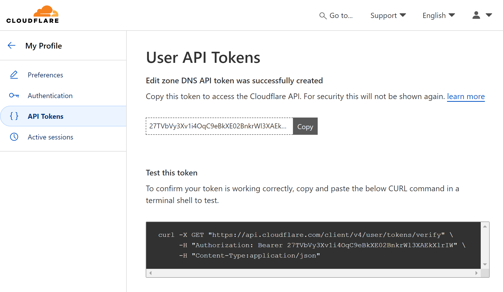

## The Unexpected Change

For years, I've been using acme.sh to manage my Let's Encrypt certificates, with GoDaddy as my DNS provider. This setup allowed me to automate certificate renewals through DNS-01 challenges. 

However, on May 1, 2024, everything changed.

GoDaddy implemented a significant policy shift, restricting access to their DNS API. Accounts could only access the DNS API if they met one of these criteria:

* Having 10 or more domains registered with GoDaddy
* Subscribing to their Discount Domain Club

Apparently, I didn't meet any of these criteria, and I wouldn't pay extra money just to use their API for any reason.

I came across a Reddit post ([PSA: GoDaddy has changed its API access. Affects ACME/LetsEncrypt](https://www.reddit.com/r/PFSENSE/comments/1cwuwdo/psa_godaddy_has_changed_its_api_access_affects/)) discussing the change, the the solution is to switch to Cloudflare.

## The Solution: Migrating to Cloudflare

After some research, I found that many users in similar situations were recommending Cloudflare as a reliable and user-friendly option. Here's what needs to be done to make the switch, in a nutshell:

1. Change DNS Provider:

   * Create a Cloudflare account if you don't already have one.
   * Add your domain to Cloudflare and follow their instructions to update your nameservers.
Wait for the DNS changes to propagate (this can take up to 48 hours, but often happens much faster).


2. Get an API Token from Cloudflare:

   * Log into your Cloudflare account.
   * Navigate to the "My Profile" -> "API Tokens".
     
   * You could use the template "Edit Zone DNS" and select your domain.
     
   * In "Zone Resources", for minimal permissions sake, you could select "Include" "Specific zone", and select your domain you want to acme.sh to get the certificates.
     
   * Make sure to copy and securely store the API token - you'll need it for the next step.
     Note: You could verify the token works by running the command on the webpage.
     


3. Update acme.sh Settings:

Since I already have acme.sh configured to use GoDaddy for DNS-01 challenges, and I'm too lazy to delete the old GoDaddy API settings and add new settings, I'll just update the acme.sh configuration to use Cloudflare for DNS-01 challenges.

* cd to where your acme.sh is installed, for my case, it's installed in `/data/acme.sh`
* Change `account.conf` in the acme.sh directory.
  The `account.conf` file contains the following content:
  ```ini
  LOG_FILE='/data/acme.sh/acme.sh.log'
  #LOG_LEVEL=1
  
  #AUTO_UPGRADE="1"
  
  #NO_TIMESTAMP=1
  ACCOUNT_EMAIL='xxxx@xxxx.com'
  USER_PATH='......'
  SAVED_GD_Key='dKt9.......'
  SAVED_GD_Secret='WGC.......'
  UPGRADE_HASH='0d8a31......'
  ```
  remove `SAVED_GD_Key` and `SAVED_GD_Secret`, and add the following to the last line of the file:
  ```ini
  SAVED_CF_Token='THE API TOKEN YOU JUST GOT FROM CLOUDFLARE IN THE LAST STEP'
  SAVED_CF_Account_ID=''
  ```

  the file would look like this:
  ```ini
  LOG_FILE='/data/acme.sh/acme.sh.log'
  #LOG_LEVEL=1
  
  #AUTO_UPGRADE="1"
  
  #NO_TIMESTAMP=1
  ACCOUNT_EMAIL='xxxx@xxxx.com'
  USER_PATH='......'
  UPGRADE_HASH='0d8a31......'
  SAVED_CF_Token='THE API TOKEN YOU JUST GOT FROM CLOUDFLARE IN THE LAST STEP'
  SAVED_CF_Account_ID=''
  ```

* Update the DNS provider in acme.sh to use Cloudflare for DNS-01 challenges.
run `acme.sh --renew-all` to renew all certificates with updated DNS provider settings.
First few lines of the output would be like this:
```
root@lora:~/.acme.sh# acme.sh --renew-all
[Sat Jul 20 16:46:07 CST 2024] Renew: 'xxxxxxxxxx.com'
[Sat Jul 20 16:46:07 CST 2024] Renew to Le_API=https://acme-v02.api.letsencrypt.org/directory
[Sat Jul 20 16:46:09 CST 2024] Using CA: https://acme-v02.api.letsencrypt.org/directory
[Sat Jul 20 16:46:09 CST 2024] Single domain='xxxxxxxxxx.com'
[Sat Jul 20 16:46:13 CST 2024] Getting webroot for domain='xxxxxxxxxx.com'
[Sat Jul 20 16:46:14 CST 2024] Adding txt value: xxxxxxxxxxxxx for domain:  _acme-challenge.xxxxxxxxxx.com
[Sat Jul 20 16:46:17 CST 2024] Adding record
[Sat Jul 20 16:46:17 CST 2024] Added, OK
[Sat Jul 20 16:46:17 CST 2024] The txt record is added: Success.
[Sat Jul 20 16:46:17 CST 2024] Let's check each DNS record now. Sleep 20 seconds first.
[Sat Jul 20 16:46:39 CST 2024] You can use '--dnssleep' to disable public dns checks.
[Sat Jul 20 16:46:39 CST 2024] See: https://github.com/acmesh-official/acme.sh/wiki/dnscheck
[Sat Jul 20 16:46:39 CST 2024] Checking xxxxxxxxxx.com for _acme-challenge.xxxxxxxxxx.com
[Sat Jul 20 16:46:40 CST 2024] Domain xxxxxxxxxx.com '_acme-challenge.xxxxxxxxxx.com' success.
[Sat Jul 20 16:46:40 CST 2024] All success, let's return
[Sat Jul 20 16:46:40 CST 2024] Verifying: xxxxxxxxxx.com
[Sat Jul 20 16:46:41 CST 2024] Pending, The CA is processing your order, please just wait. (1/30)
[Sat Jul 20 16:46:45 CST 2024] Success
[Sat Jul 20 16:46:45 CST 2024] Removing DNS records.
[Sat Jul 20 16:46:45 CST 2024] Removing txt: xxxxxxxxxxx for domain: _acme-challenge.xxxxxxxx.com
[Sat Jul 20 16:46:49 CST 2024] Removed: Success
[Sat Jul 20 16:46:49 CST 2024] Verify finished, start to sign.
[Sat Jul 20 16:46:49 CST 2024] Lets finalize the order.
[Sat Jul 20 16:46:49 CST 2024] Le_OrderFinalize='https://acme-v02.api.letsencrypt.org/acme/finalize/xxxxxxxxxxx'
[Sat Jul 20 16:46:52 CST 2024] Downloading cert.
[Sat Jul 20 16:46:52 CST 2024] Le_LinkCert='https://acme-v02.api.letsencrypt.org/acme/cert/xxxxxxxxxx'
[Sat Jul 20 16:46:54 CST 2024] Cert success.
```

Seeing the `Cert success.` really confirmed the certificate was renewed successfully.

## The Benefits of the Switch
While this change was initially frustrating, many users (myself included) have found several advantages to using Cloudflare:

* Cloudflare's DNS is free and works seamlessly with certbot and pfSense DDNS updates.
Their API is reliable and well-documented.
* Cloudflare offers additional services that can improve your website's performance and security.

## Conclusion
The sudden change by GoDaddy was a reminder of how important it is to stay flexible in our tech setups. While it caused some temporary inconvenience, the move to Cloudflare has ultimately resulted in a more robust and feature-rich DNS management solution.

For those still using GoDaddy and encountering issues with Let's Encrypt renewals, I highly recommend making the switch to Cloudflare or another DNS provider that offers reliable API access for DNS-01 challenges. The process might seem daunting at first, but the long-term benefits are well worth the effort.