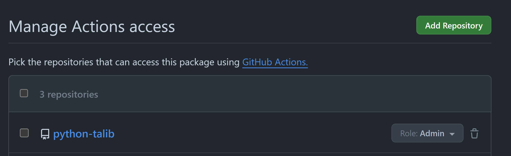

I was learning use kaniko to build image without Docker in Docker (DinD), so I cloned [the repo](https://github.com/ukeweu/python-talib) to test it out.


The build process with kaniko was OK, however following error shown while pushing image to GitHub Container Registry (GHCR):

```
Error: unexpected status from POST request to https://ghcr.io/v2/....../blobs/uploads/: 403 Forbidden
```

Start troubleshooting!

------

First, check if the workflow/job had sufficient permissions, in the yaml file we need:

```
permissions:
  packages: write
```

I've already done that before cloning the repo, so it's clear not the case.

Next thought it might be the naming issue, so I changed the image name (from python-talib:latest to python_talib_test:latest), it worked!?

After an hour of investigating, here's why I had done, causing image pushing failed with name `python-lalib`:
- I created the package `python-talib` with a GitHub Action workflow in repo `test-build-image`.
- I tried pushing `python-talib` in the repo `python-talib`, encountered 403.

GitHub refused pushing image with name `python-talib` in repo `python-talib`'s workflow because the image name was first created in repo `test-build-image`'s workflow, thus any other repo will not have permission to write new data.

To solve issue, goto the package setting of `python-talib` package, in 'Manage Actions access', add the `python-talib` repository, and change its role to 'Admin' or 'Write'.


