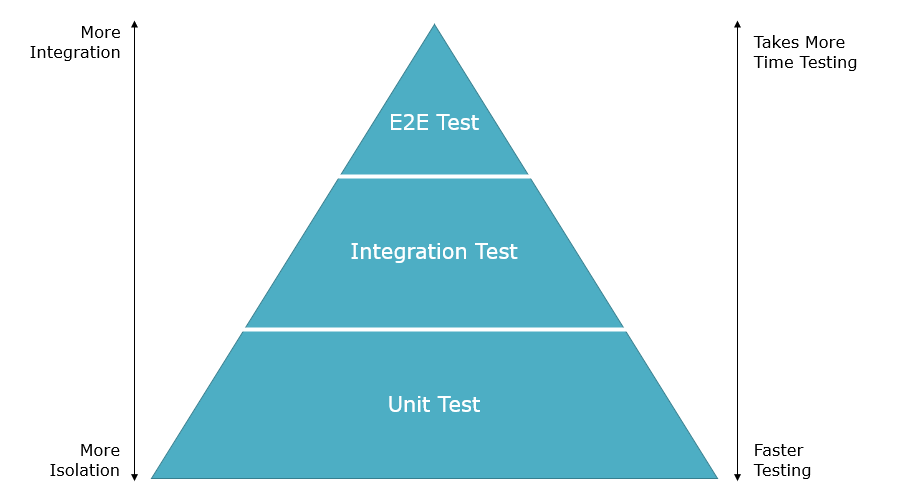
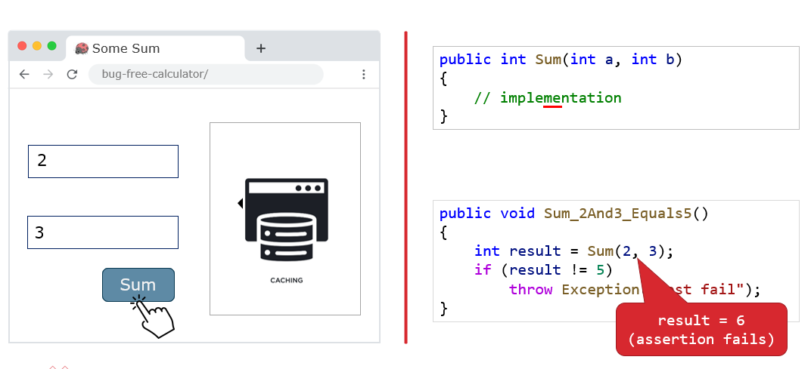
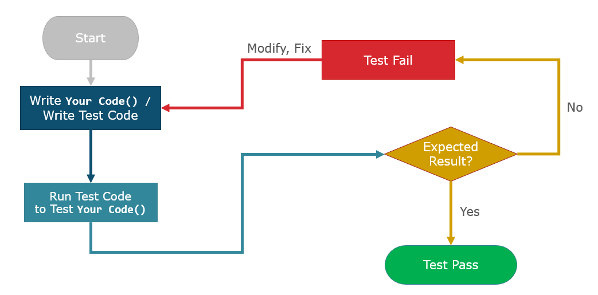
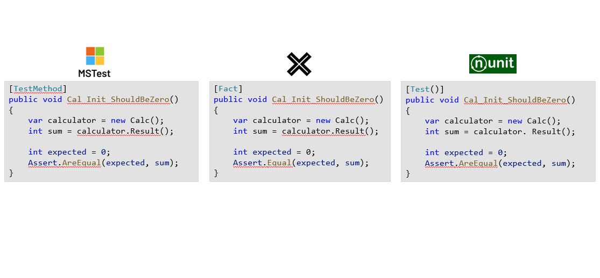
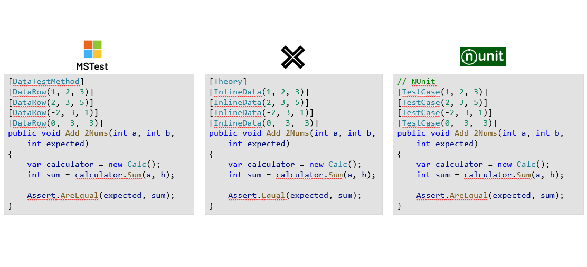
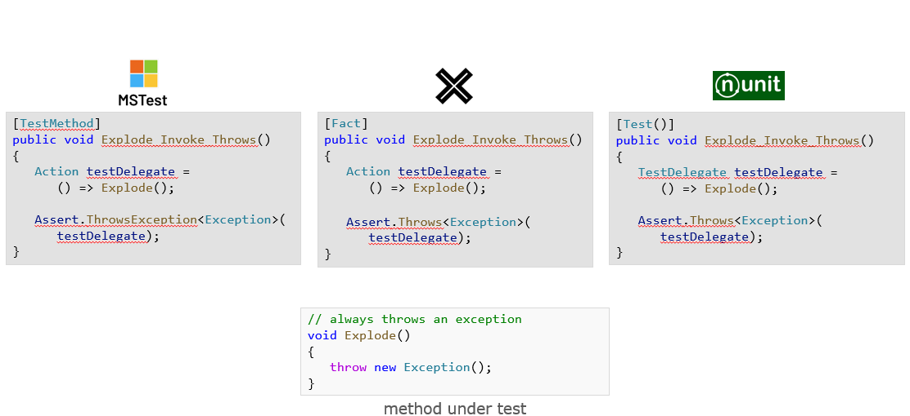
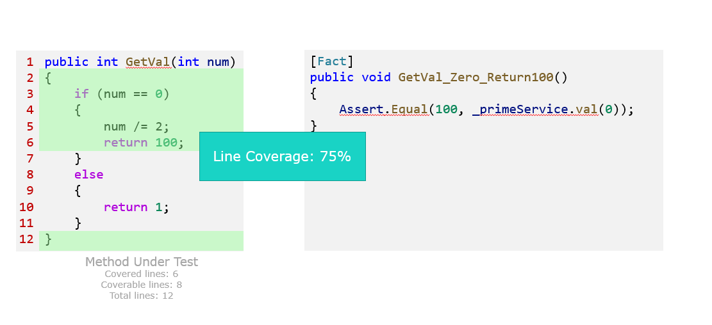
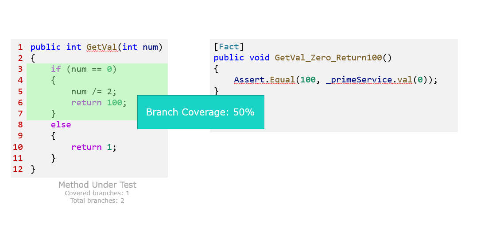
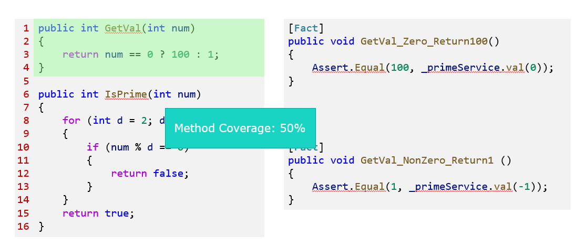

## Why Testing is Necessary

The same software bug, when fixed later in the development process or even after the system has gone live, can cost much more than if it had been fixed at the beginning of development

If there were a way to discover defects early in the development, it could save a lot of costs.

## Types of Tests

Generally, people talking about software testing usually posts a picture of a triangle, stating that testing can divided into 3 types, from bottom to top are:

- Unit Testing
- Integration Testing
- End-to-End (E2E) Testing



Higher-level tests validate the interactions between components, but due to the time required to write and execute these tests, there aren’t as many of them.

Conversely, lower-level tests focus more on whether the internal logic of the components is working correctly. These tests are relatively faster to run and are more numerous.

### How Different Types of Tests Are Used

The figure below shows the process of discovering and fixing a bug in a mathematical operation (**addition** written as **multiplication**):

- E2E Testing:
    - The entire execution environment must be set up: web server, browser, and frontend all need to be ready.
    - The user's workflow must be simulated to find this defect. It involves opening a browser, entering a URL, clicking the desired feature, entering test data, and verifying the output to discover the issue.
    - After fixing the bug, the same process must be repeated to verify the issue is resolved.
    - Verification may encounter issues unrelated to the root cause, such as network problems or cache issues, which can prolong the testing time.
- Unit Testing:
    - Focuses solely on testing the internal computation logic, so a complete execution environment is not necessary.
    - By writing code to call the Sum() method and verifying the returned value meets expectations, the functionality can be confirmed.
    - After the bug is fixed, running the same code again will verify whether the issue has been resolved.
    - Unit tests focus only on whether their logic is correct, disregarding external factors, thus they can quickly verify if the logic is correct.

These differences highlight why there are variations in the costs of test writing, functionality verification, and fixing.



## What is Unit Testing

It is a method that starts with the smallest functionalities to verify if the code works correctly on its own.

### How Unit Testing Works and Ensures My Developed Features Behave as Intended

A piece of code is written according to testing conditions, calling the function to be verified, and predetermined conditions decide whether the function operates as expected.



### Advantages of Using Unit Testing

- Early detection of bugs
- Short testing time
- Prevents breaking old functionalities
- Serves as sample code

### Example of Unit Testing

Here is the code to be tested, including an `if` statement. If value of `id` is less than 1, it returns one type of result, otherwise another type of result:

```cs
public class ProductController : Controller
{
    public ActionResult Details(int id)
    {
        if (id < 1)
            return RedirectToAction("Index");

        var product = new Product(Id, "Laptop");
        return View("Details", product);
    }
}
```

Most of the time we use off-the-shelf test frameworks to write unit tests, bringing the following benefits:

- Use of attributes and APIs to organize unit test code, set up the test environment, and validate test results
- Help generate test reports
- Integration with IDEs and CI/CD pipelines for easy test execution

Using a C# test framework, xUnit, we write a unit test to verify that when `id` is -1, the returned object meets the expectations:

```cs
using Xunit;

namespace MyProject.Tests
{
    public class ProductControllerTests
    {
        [Fact]
        public void Details_NegativeId_RedirectToIndex()
        {
            var controller = new ProductController();
            var result = controller.Details(-1) as RedirectToRouteResult;
            Assert.True(result.Values["action"] == "Index");
        }
    }
}
```

`Assert.True()` in Line 12 is an assertion provided by xUnit, which determines whether the test "passes" or "fails".

### Available Test Frameworks for .NET Project and Their Differences

Commonly available frameworks include:

- xUnit
- NUnit
- MSTest

Despite the differences, their usage is quite similar.







## ## Indicators for Evaluating the Adoption of Unit Testing

### Code Coverage

Code coverage is an indicator used to assess whether the code has been sufficiently tested.

Common code coverage metrics include:

- **Line Coverage**: Measures how many lines of code are covered by tests.
- **Branch Coverage**: Measures how many branches in the code are covered by tests.
- **Method/Function Coverage**: Measures how many methods or functions are covered by tests.

#### Line Coverage

The following figure is an example of calculating line coverage. Out of 8 lines of testable code, 6 lines are executed during testing, resulting in a line coverage of 6÷8 = 75%.



#### Branch Coverage

The next figure shows an example of branch coverage calculation. There are 2 branches, and during testing, only 1 branch is executed, resulting in a branch coverage of 1÷2 = 50%.



#### Method Coverage

The final figure illustrates method coverage calculation. There are 2 methods, and during testing, only 1 method is executed, resulting in a method coverage of 1÷2 = 50%.



### Scenario Coverage

This metric evaluates the extent to which use cases or scenarios are covered during software testing. It focuses on whether the test cases cover the application's main functionalities and potential usage scenarios to ensure that the software performs well under various conditions.

Scenario coverage differs from code coverage:

- **Code Coverage** focuses on how much of the code lines, branches, or methods are covered by test cases.
- **Scenario Coverage**, however, primarily considers the performance of the application under different scenarios, thus emphasizing the use cases involved in the testing process.

### Pass Rate

The percentage of unit tests that pass successfully. A high pass rate indicates that most tests run smoothly, representing good code quality.

### Failure Rate

The percentage of unit tests that fail. A high failure rate may indicate issues within the code that need further investigation and correction.

### Test Execution Time

The total time required for unit testing. Excessively long test times can reduce development efficiency, which can be improved by optimizing tests or reducing unnecessary tests.
