## Scenario

I have a `DemoLibrary` project written in C# and need to add a unit test project `DemoLibrary.UnitTests` to hold tests related to `DemoLibrary`.

---

## 1. Create a New Project

Within the solution, choose to add a new project.

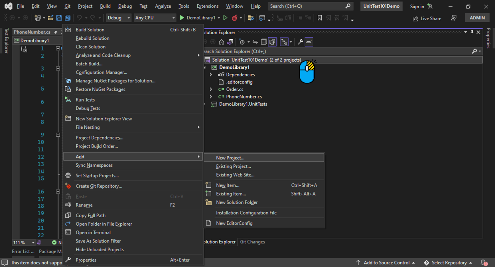

Select an xUnit test project, then click 'Next'.

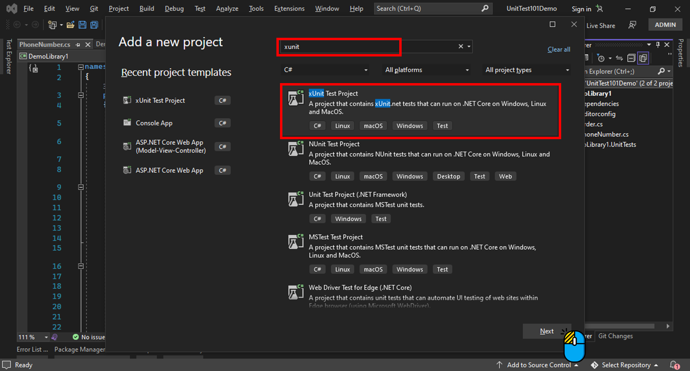

Name your test project, preferably ending with `.UnitTests` to easily filter unit test projects in the future. Then click 'Next'.

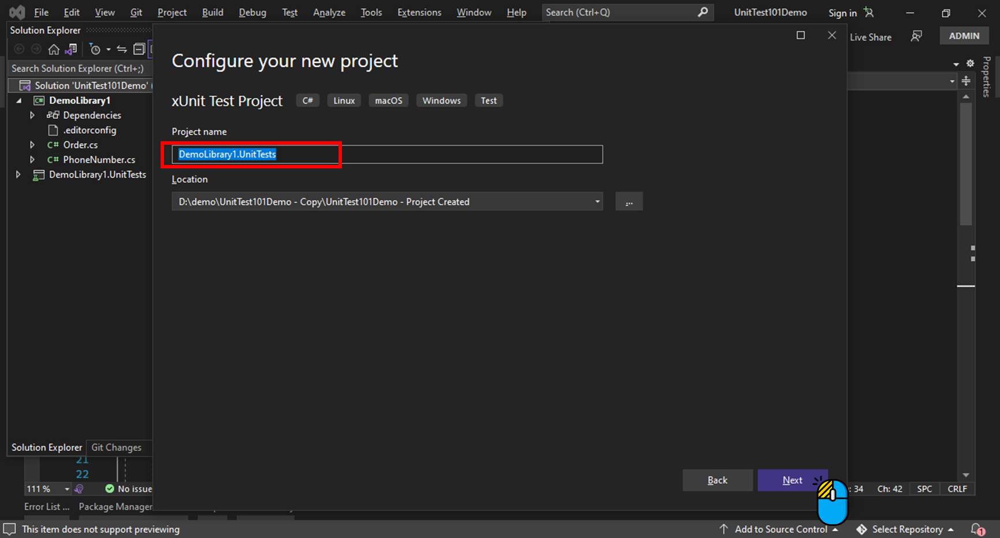

Choose the same Framework as the project being tested (in this case, .NET 6.0). Then click 'Create'.

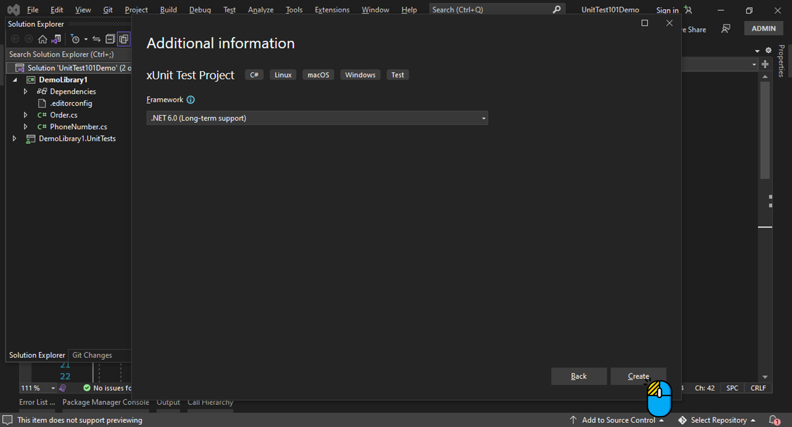

## 2. Add Project Reference

Add a project reference to the test project for the project to be tested.

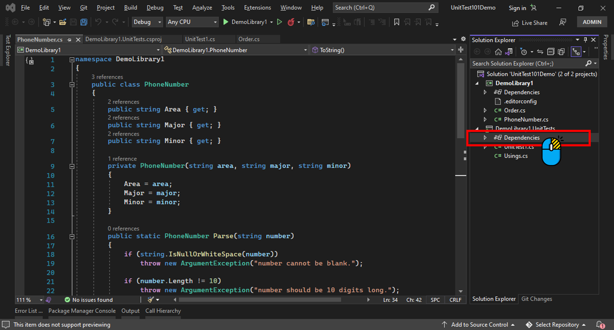

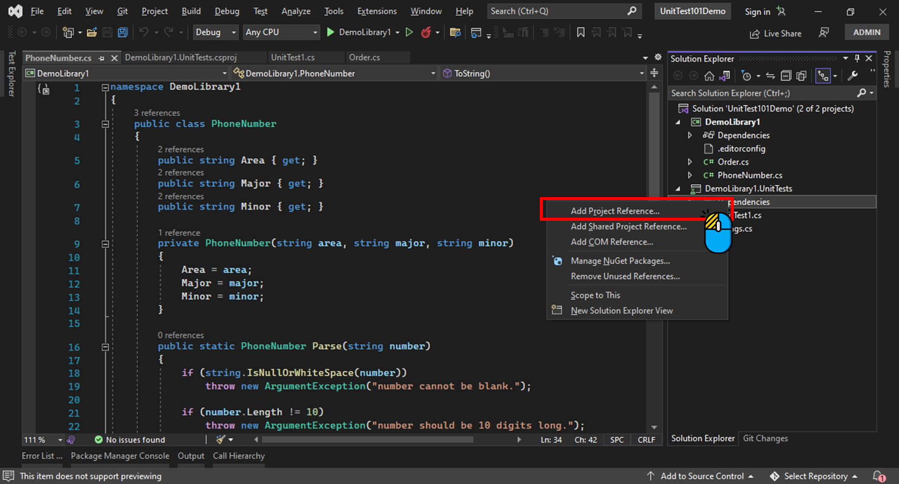

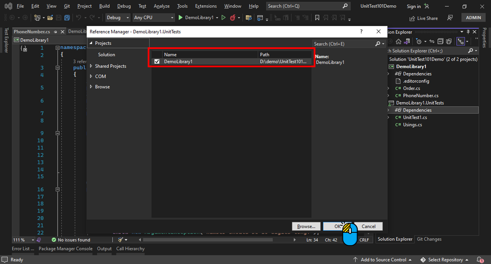

## 3. Add NuGet Packages (Optional)

If you want test reports be displayed on GitLab's CI/CD Pipeline web UI, install the `JunitXml.TestLogger` package by following the steps below.

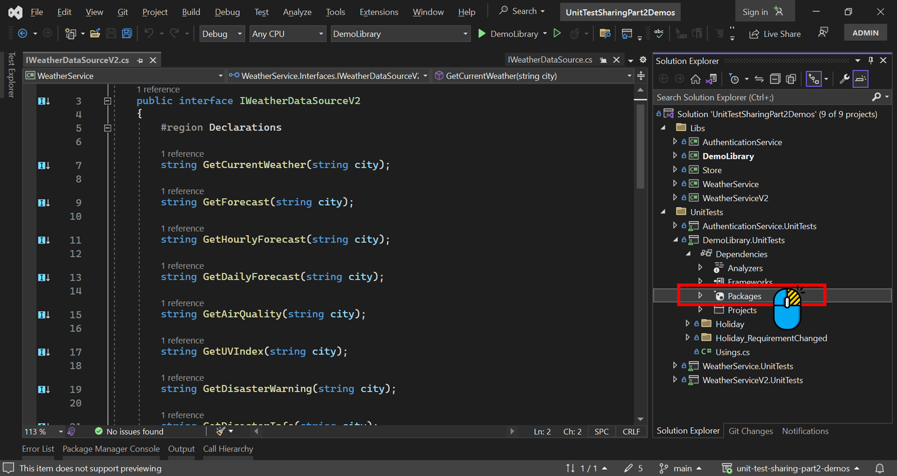

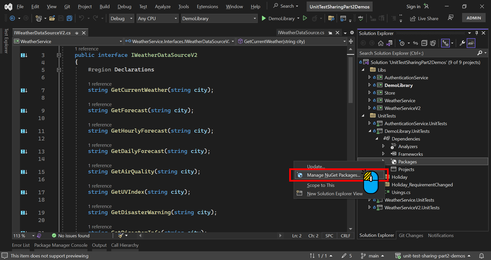

Click 'Browse' -> Enter `JunitXml.TestLogger` in the search box below.

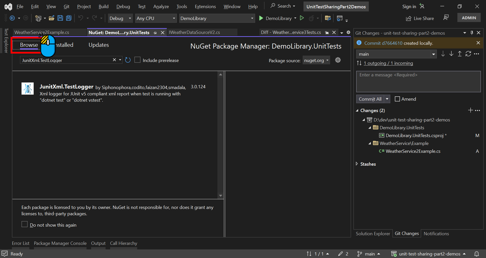

Click 'Install'.

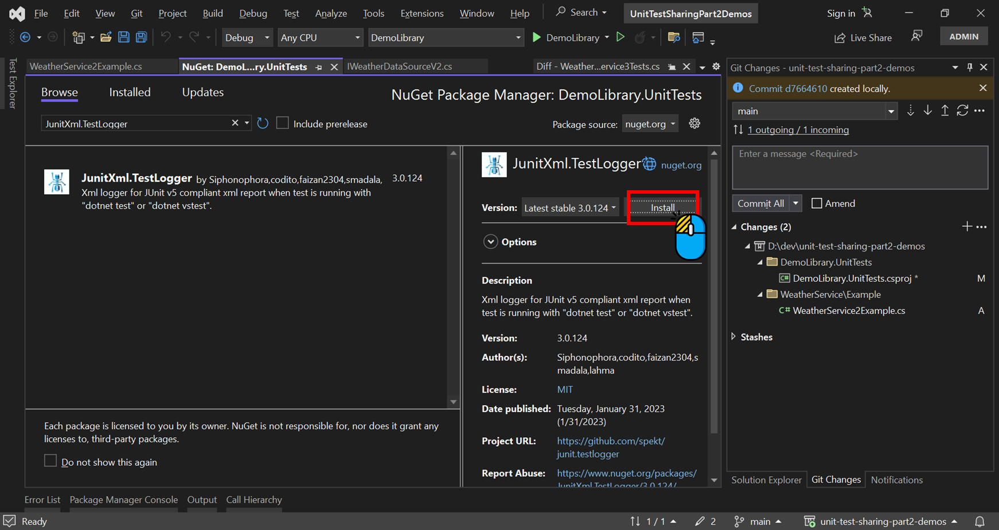

## 4. Update NuGet Packages (Optional But Recommended)

Update the NuGet packages within the project to the latest versions.

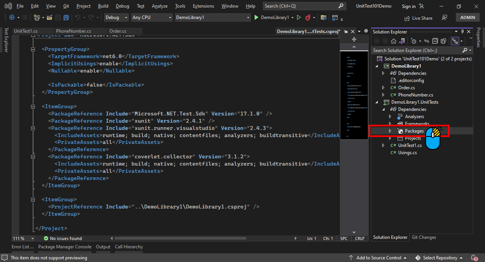

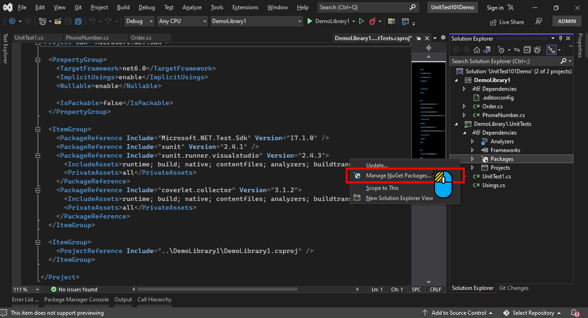

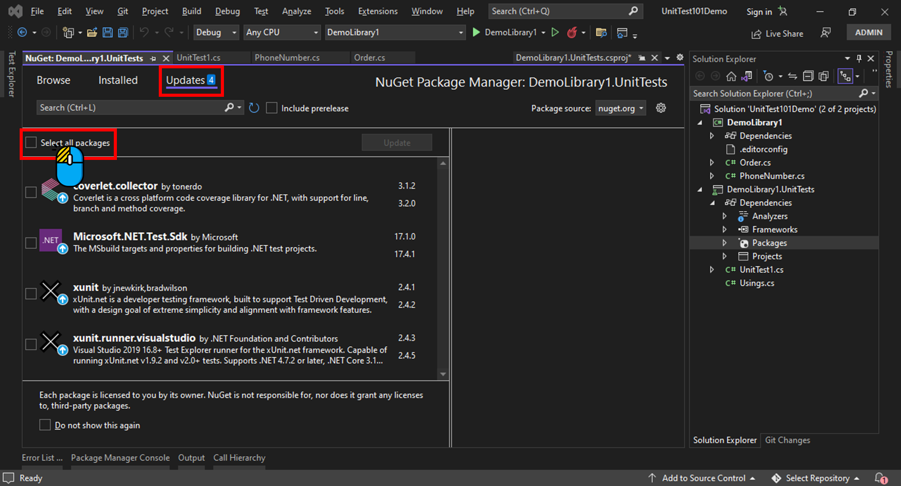

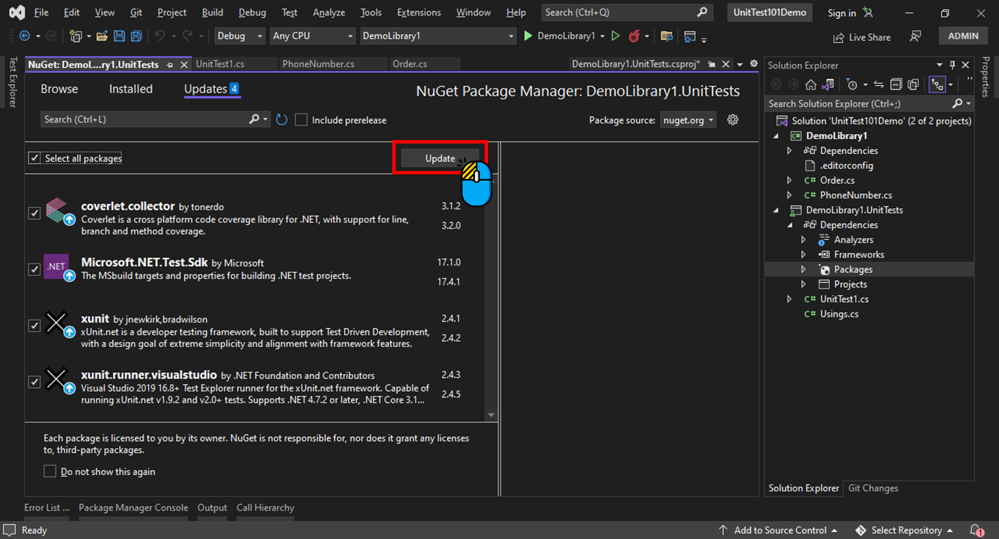

## 5. Write Tests

After the setup is complete, you can start writing tests.

Here’s a basic test:

```cs
[Fact]
public void FactUsage()
{

    // Arrange
    var admin = new User();
    var r = new Order();

    // Act
    bool result = r.IsCreatedBy(admin);

    // Assert
    Assert.True(result);
}
```
